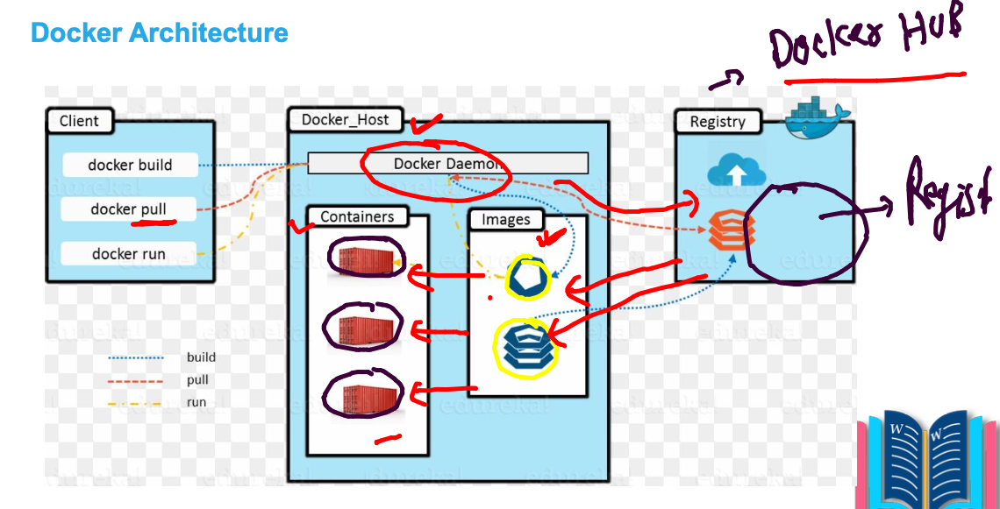
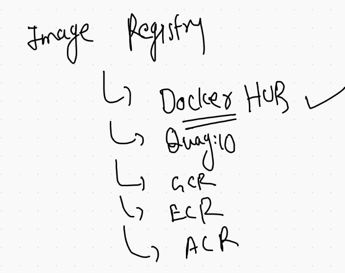
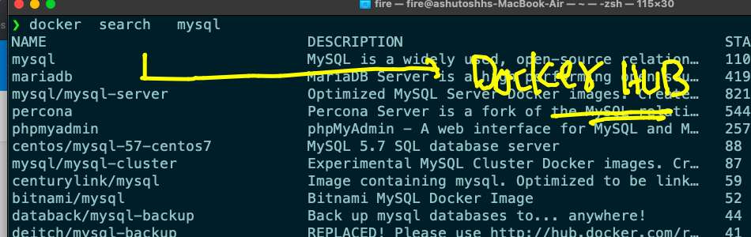
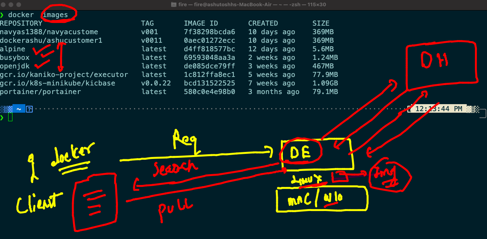
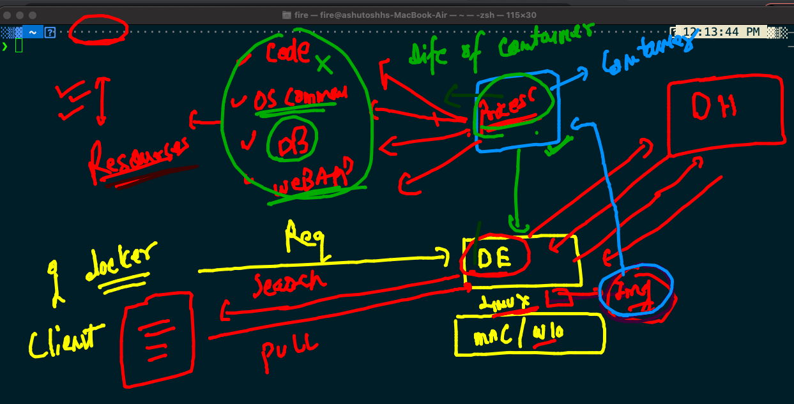
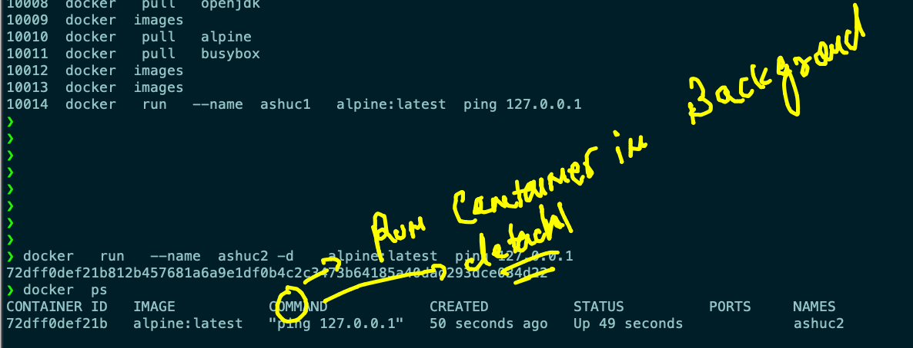
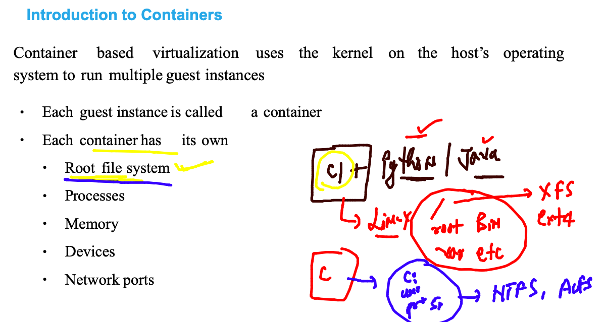
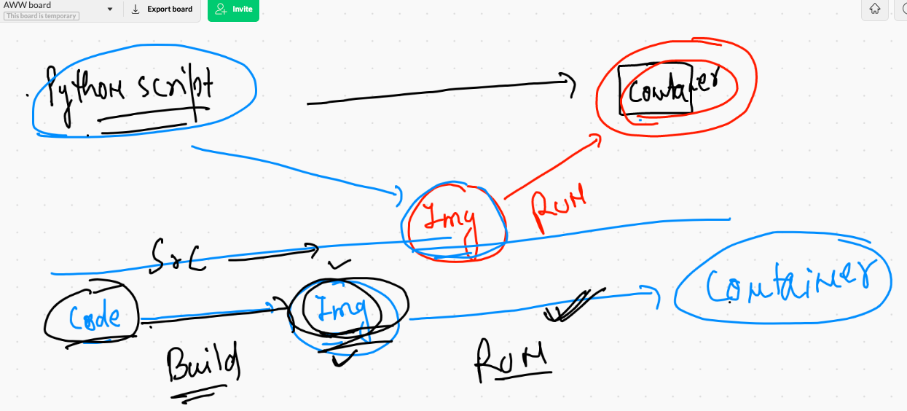
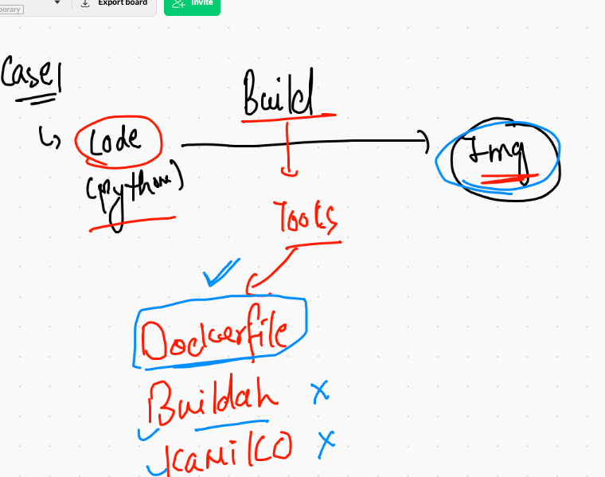
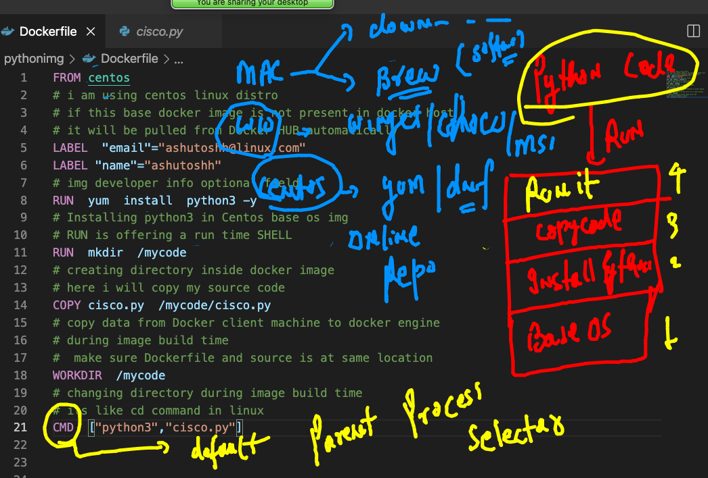

# Plan of traning and its execution 


## Pre-requisite 


## App deployment history 


## moving from base OS to Virtualization concept 


## APp platform are not using entire OS libraries and apps


## OS BASIC 


## Vm VS  containers


## Hypervisor vs CRE 


# Getting started with Docker 


## Docker ce 


## Docker ce installation 


## checking installation 

```
❯ docker version
Client:
 Cloud integration: 1.0.14
 Version:           20.10.6
 API version:       1.41
 Go version:        go1.16.3
 Git commit:        370c289
 Built:             Fri Apr  9 22:46:57 2021
 OS/Arch:           darwin/amd64
 Context:           default
 Experimental:      true

Server: Docker Engine - Community
 Engine:
  Version:          20.10.6
  API version:      1.41 (minimum version 1.12)
  Go version:       go1.13.15
  Git commit:       8728dd2
  Built:            Fri Apr  9 22:44:56 2021
  OS/Arch:          linux/amd64
  Experimental:     false
 containerd:
  Version:          1.4.4
  GitCommit:        05f951a3781f4f2c1911b05e
```

## Docker  arch 



### docker image registry 



## Docker client side operations 

### search. 



### checking images on docker host 

```
❯ docker   images
REPOSITORY                       TAG       IMAGE ID       CREATED        SIZE
navyas1388/navyacustome          v001      7f38298bcda6   10 days ago    369MB
dockerashu/ashucustomer1         v0011     0aec01272ecc   10 days ago    369MB
gcr.io/kaniko-project/executor   latest    1c812ffa8ec1   5 weeks ago    77.9MB
gcr.io/k8s-minikube/kicbase      v0.0.22   bcd131522525   7 weeks ago    1.09GB
portainer/portainer              latest    580c0e4e98b0   3 months ago   79.1MB

```

### pulling image into docker host 

```
❯ docker   pull   openjdk
Using default tag: latest
latest: Pulling from library/openjdk
5a581c13a8b9: Downloading [=========================>                         ]  21.76MB/42.18MB
26cd02acd9c2: Download complete 
66727af51578: Downloading [=====>                                             ]  19.26MB/184.8MB


```

--

```
❯ docker   pull   alpine
Using default tag: latest
latest: Pulling from library/alpine
5843afab3874: Pull complete 
Digest: sha256:234cb88d3020898631af0ccbbcca9a66ae7306ecd30c9720690858c1b007d2a0
Status: Downloaded newer image for alpine:latest
docker.io/library/alpine:latest
❯ docker   pull   busybox
Using default tag: latest
latest: Pulling from library/busybox
b71f96345d44: Pull complete 
Digest: sha256:930490f97e5b921535c153e0e7110d251134cc4b72bbb8133c6a5065cc68580d
Status: Downloaded newer image for busybox:latest
docker.io/library/busybox:latest
❯ docker  images
REPOSITORY                       TAG       IMAGE ID       CREATED        SIZE
navyas1388/navyacustome          v001      7f38298bcda6   10 days ago    369MB
dockerashu/ashucustomer1         v0011     0aec01272ecc   10 days ago    369MB
alpine                           latest    d4ff818577bc   12 days ago    5.6MB
busybox                          latest    69593048aa3a   2 weeks ago    1.24MB
openjdk                          latest    de085dce79ff   3 weeks ago    467MB
gcr.io/kaniko-project/executor   latest    1c812ffa8ec1   5 weeks ago    77.9MB

```

## Docker client and ENgine work flow 



## Process in container 



## creating containers 

```
❯ docker   run   --name  ashuc1   alpine:latest  ping 127.0.0.1
PING 127.0.0.1 (127.0.0.1): 56 data bytes
64 bytes from 127.0.0.1: seq=0 ttl=64 time=0.100 ms
64 bytes from 127.0.0.1: seq=1 ttl=64 time=0.392 ms
64 bytes from 127.0.0.1: seq=2 ttl=64 time=0.132 ms
64 bytes from 127.0.0.1: seq=3 ttl=64 time=0.124 ms
64 bytes from 127.0.0.1: seq=4 ttl=64 time=0.134 ms
64 bytes from 127.0.0.1: seq=5 ttl=64 time=0.113 ms
64 bytes from 127.0.0.1: seq=6 ttl=64 time=0.164 ms
64 bytes from 127.0.0.1: seq=7 ttl=64 time=0.201 ms
64 bytes from 127.0.0.1: seq=8 ttl=64 time=0.237 ms
64 bytes from 127.0.0.1: seq=9 ttl=64 time=0.131 ms
^C
--- 127.0.0.1 ping statistics ---
10 packets transmitted, 10 packets received, 0% packet loss
round-trip min/avg/max = 0.100/0.172/0.392 ms


```

## best practise to create container 



### checking output of a running container parent process

```
10017  docker  ps
10018  docker  logs   ashuc2 

10020  docker  ps
10021  docker  logs   72dff0def21b 

```

### stopping current running container 

```
❯ docker  kill   ashuc2
ashuc2
❯ docker  ps
CONTAINER ID   IMAGE     COMMAND   CREATED   STATUS    PORTS     NAMES

```

### listing all the containers

```
❯ docker  ps -a
CONTAINER ID   IMAGE                                   COMMAND                  CREATED         STATUS                        PORTS                                                                                                                                  NAMES
72dff0def21b   alpine:latest                           "ping 127.0.0.1"         8 minutes ago   Exited (137) 56 seconds ago                                                                                                                                          ashuc2
24bf9537274e   alpine:latest                           "ping 127.0.0.1"         9 minutes ago   Exited (0) 9 minutes ago                                                                                                                                             ashuc1

```

### starting container 

```
❯ docker  start   ashuc2
ashuc2
❯ docker  start   ashuc1
ashuc1
❯ docker   ps
CONTAINER ID   IMAGE           COMMAND            CREATED          STATUS         PORTS     NAMES
72dff0def21b   alpine:latest   "ping 127.0.0.1"   9 minutes ago    Up 6 seconds             ashuc2
24bf9537274e   alpine:latest   "ping 127.0.0.1"   10 minutes ago   Up 2 seconds             ashuc1

```

### stopping container 

```
❯ docker  ps
CONTAINER ID   IMAGE           COMMAND            CREATED          STATUS         PORTS     NAMES
72dff0def21b   alpine:latest   "ping 127.0.0.1"   11 minutes ago   Up 2 minutes             ashuc2
24bf9537274e   alpine:latest   "ping 127.0.0.1"   12 minutes ago   Up 2 minutes             ashuc1
❯ docker  kill   ashuc1  ashuc2
ashuc1
ashuc2
❯ docker  ps
CONTAINER ID   IMAGE     COMMAND   CREATED   STATUS    PORTS     NAMES
❯ 
❯ docker  start   ashuc1  ashuc2
ashuc1
ashuc2
❯ docker   ps
CONTAINER ID   IMAGE           COMMAND            CREATED          STATUS         PORTS     NAMES
72dff0def21b   alpine:latest   "ping 127.0.0.1"   12 minutes ago   Up 2 seconds             ashuc2
24bf9537274e   alpine:latest   "ping 127.0.0.1"   13 minutes ago   Up 2 seconds             ashuc1


```

### removing continaer. 

## Process in container 

```
❯ docker  rm   ashuc1
ashuc1
❯ docker   ps  -a
CONTAINER ID   IMAGE                                   COMMAND                  CREATED          STATUS                        PORTS                                                                                                                                  NAMES
72dff0def21b   alpine:latest                           "ping 127.0.0.1"         13 minutes ago   Exited (137) 19 seconds ago                                                                                                                                          ashuc2

```

## Container has 

### Root file system 



### demo

```
❯ docker   exec  -it  ashuc2   sh
/ # 
/ # 
/ # 
/ # ls  /
bin    dev    etc    home   lib    media  mnt    opt    proc   root   run    sbin   srv    sys    tmp    usr    var
/ # uname 
Linux
/ # 


```

### has its own process

```
 # ps  -e
PID   USER     TIME  COMMAND
    1 root      0:00 ping 127.0.0.1
   24 root      0:00 sh
   33 root      0:00 ps -e
/ # 

```

### final demo 

```
❯ docker   exec  -it  ashuc2   sh
/ # 
/ # 
/ # 
/ # ls  /
bin    dev    etc    home   lib    media  mnt    opt    proc   root   run    sbin   srv    sys    tmp    usr    var
/ # uname 
Linux
/ # ps  -e
PID   USER     TIME  COMMAND
    1 root      0:00 ping 127.0.0.1
   24 root      0:00 sh
   33 root      0:00 ps -e
/ # ifconfig 
eth0      Link encap:Ethernet  HWaddr 02:42:AC:11:00:02  
          inet addr:172.17.0.2  Bcast:172.17.255.255  Mask:255.255.0.0
          UP BROADCAST RUNNING MULTICAST  MTU:1500  Metric:1
          RX packets:14 errors:0 dropped:0 overruns:0 frame:0
          TX packets:0 errors:0 dropped:0 overruns:0 carrier:0
          collisions:0 txqueuelen:0 
          RX bytes:1156 (1.1 KiB)  TX bytes:0 (0.0 B)

lo        Link encap:Local Loopback  
          inet addr:127.0.0.1  Mask:255.0.0.0
          UP LOOPBACK RUNNING  MTU:65536  Metric:1
          RX packets:908 errors:0 dropped:0 overruns:0 frame:0
          TX packets:908 errors:0 dropped:0 overruns:0 carrier:0
          collisions:0 txqueuelen:1000 
          RX bytes:76272 (74.4 KiB)  TX bytes:76272 (74.4 KiB)

/ # exit

```

## Best way to create a fresh container 

```
❯ docker   run  -itd  --name x1  alpine  ping google.com
65883a58844dca0e336bf69d434be45420310c5822833aa093542d8d589da697
❯ docker   run  -itd  --name x2  alpine
25b7f1c04519f291ece31534921f5f01fd41dcac92f83774e6356d2bc1647a37
doc%                                                                                                                           ❯ docker  ps
CONTAINER ID   IMAGE           COMMAND             CREATED              STATUS              PORTS     NAMES
25b7f1c04519   alpine          "/bin/sh"           5 seconds ago        Up 3 seconds                  x2
65883a58844d   alpine          "ping google.com"   11 seconds ago       Up 9 seconds                  x1

```

## Custom image building 




## Introduction to docker image building tools 



## Dockerfile 

### Example 1. -- Python code 



### building image 

```
❯ ls
Dockerfile cisco.py
❯ docker  build  -t  python:ashuv1  .
[+] Building 24.6s (11/11) FINISHED                                                                      
 => [internal] load build definition from Dockerfile                                                0.3s
 => => transferring dockerfile: 832B                                                                0.1s
 => [internal] load .dockerignore                                                                   0.2s
 => => transferring context: 2B                                                                     0.0s
 => [internal] load metadata for docker.io/library/centos:latest                                    3.3s
 => [auth] library/centos:pull token for registry-1.docker.io                                       0.0s
 => CACHED [1/5] FROM docker.io/library/centos@sha256:5528e8b1b1719d34604c87e11dcd1c0a20bedf46e83b  0.0s
 => [internal] load build context                                                                   0.2s
 => => transferring context: 286B                                                                   0.1s
 => [2/5] RUN  yum  install  python3 -y                                                            18.7s
 => [3/5] RUN  mkdir  /mycode                                                                       0.8s 
 => [4/5] COPY cisco.py  /mycode/cisco.py                                                           0.2s 
 => [5/5] WORKDIR  /mycode                                                                          0.1s 
 => exporting to image                                                                              1.0s 
 => => exporting layers                                                                             0.9s 
 => => writing image sha256:9aaf6951e667ab4199e95b85b23a62ab428d77895f3ba0b69d0e5d36820d93ab        0.0s 
 => => naming to docker.io/library/python:ashuv1 
 
 ```
 
 ### checking image build 
 
 ```
 ❯ docker  images
REPOSITORY                       TAG       IMAGE ID       CREATED          SIZE
python                           ashuv1    9aaf6951e667   50 seconds ago   252MB
navyas1388/navyacustome          v001      7f38298bcda6   10 days ago      369MB
dockerashu/ashucustomer1         v0011     0aec01272ecc   10 days ago      369MB

```

### RUnning a container from last build docker image

```
❯ docker   run  -itd --name ashupyc1  python:ashuv1
b7ce0d15162d25f740fc81d8d17e5cf34713507cdc301147cd749add93519121
❯ docker  ps
CONTAINER ID   IMAGE           COMMAND              CREATED          STATUS          PORTS     NAMES
b7ce0d15162d   python:ashuv1   "python3 cisco.py"   4 seconds ago    Up 3 seconds              ashupyc1

```

### checking output of default process in real time 

```
docker  logs -f   ashupyc1 

```

### full history of last build 

```
10005  docker   run  -itd --name ashupyc1  python:ashuv1   
10006  docker  ps
10007  history
10008  docker  ps
10009  docker  logs  ashupyc1 
10010  docker  logs -f   ashupyc1 
10011  history
10012  docker  ps
10013  docker  stop  ashupyc1
10014  docker  ps
10015  docker  start  ashupyc1
10016  docker  ps
10017  docker  kill  ashupyc1

```

## case 2 -- working in DOcker engine 

### LInux VM --- installing docker ce 

```
[root@ip-172-31-75-82 ~]# yum   install  docker  -y
Failed to set locale, defaulting to C
Loaded plugins: extras_suggestions, langpacks, priorities, update-motd
amzn2-core                                                                                         | 3.7 kB  00:00:00     
amzn2extra-docker                                                                                  | 3.0 kB  00:00:00     
Package docker-20.10.4-1.amzn2.x86_64 already installed and latest version
Nothing to do

```

### enabling docker engine 

```
[root@ip-172-31-75-82 ~]# systemctl enable --now  docker 
[root@ip-172-31-75-82 ~]# systemctl status  docker 
● docker.service - Docker Application Container Engine
   Loaded: loaded (/usr/lib/systemd/system/docker.service; enabled; vendor preset: disabled)
   Active: active (running) since Mon 2021-06-28 03:15:06 UTC; 7h ago
     Docs: https://docs.docker.com
 Main PID: 2960 (dockerd)
   CGroup: /system.slice/docker.service
           └─2960 /usr/bin/dockerd -H fd:// --containerd=/run/containerd/containerd.sock --default-ulimit nofile=1024:4...

Jun 28 03:15:06 ip-172-31-75-82.ec

```

### to install docker manually with

[docker_docs](https://docs.docker.com/engine/install/centos/)

