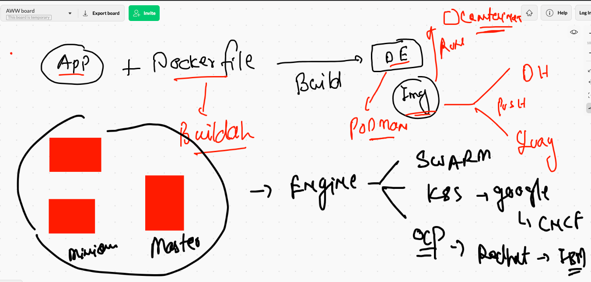
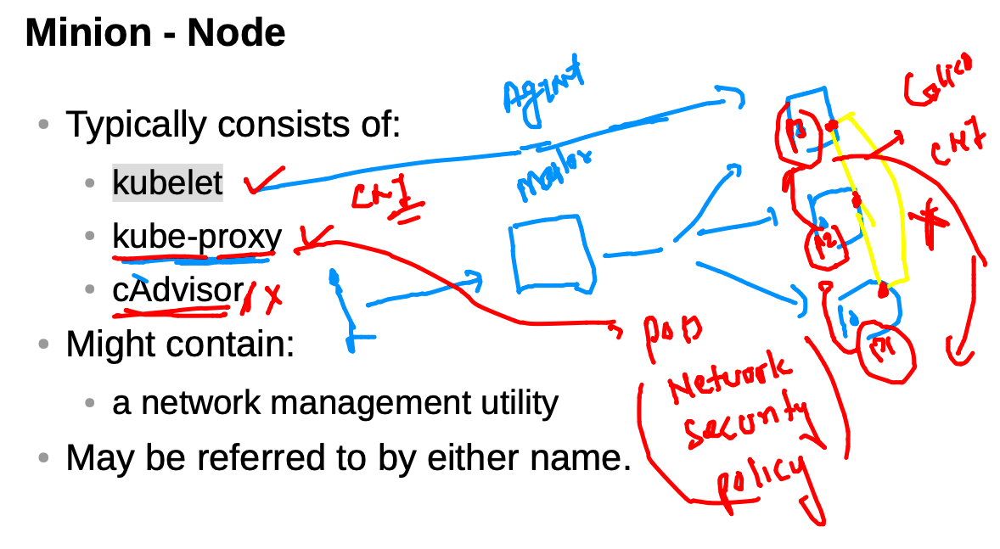
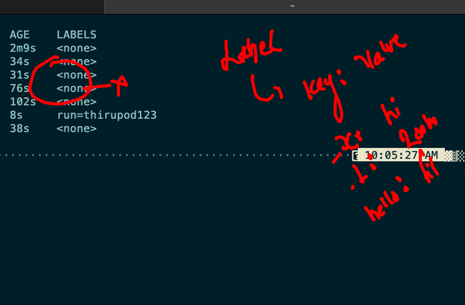
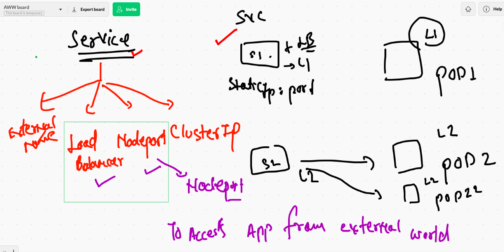
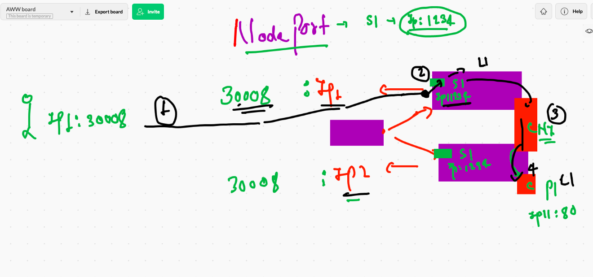
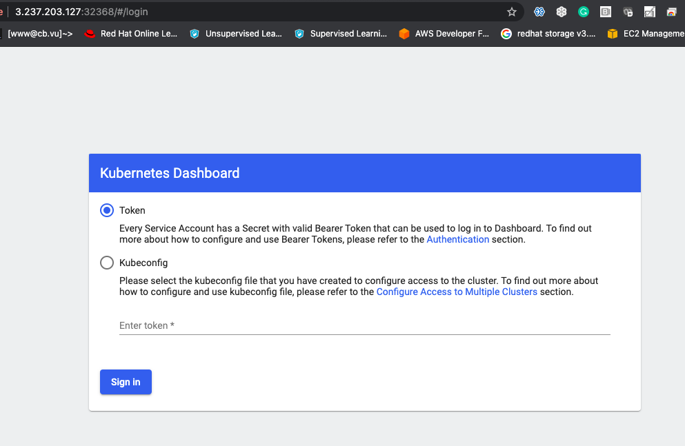
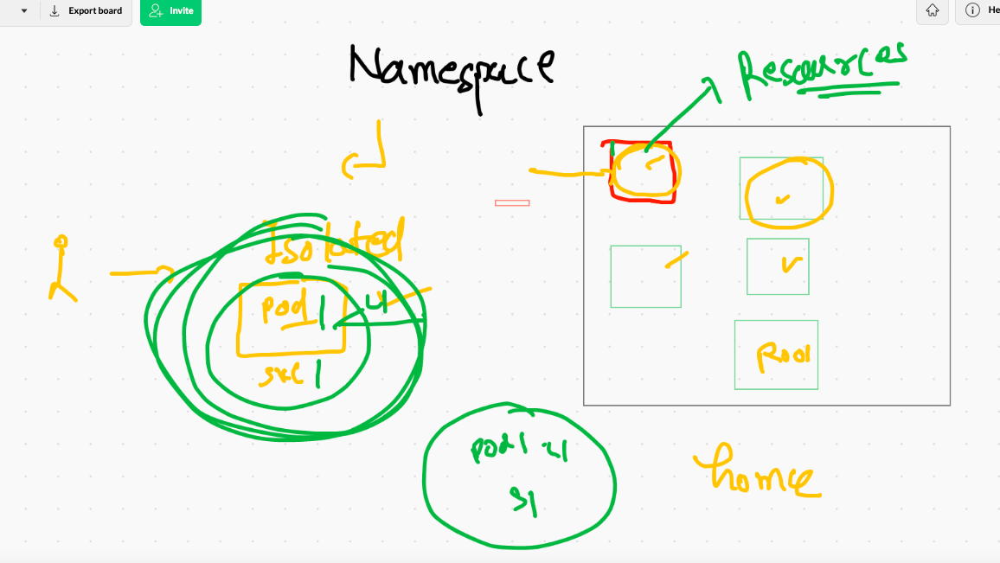
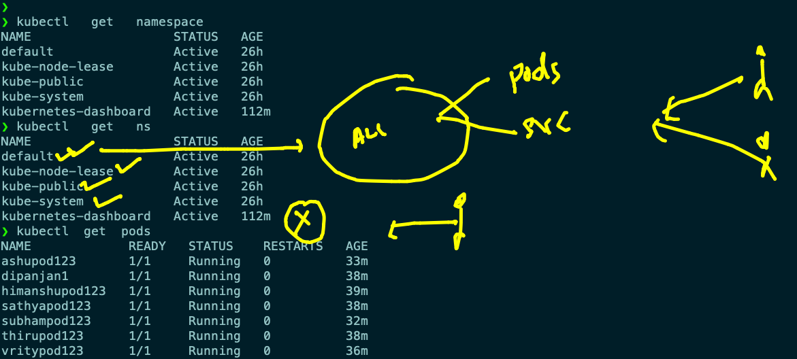
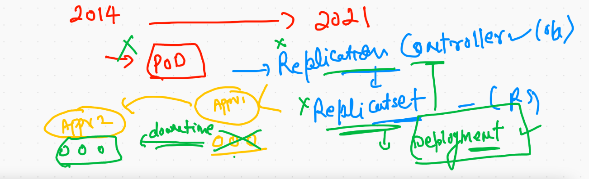
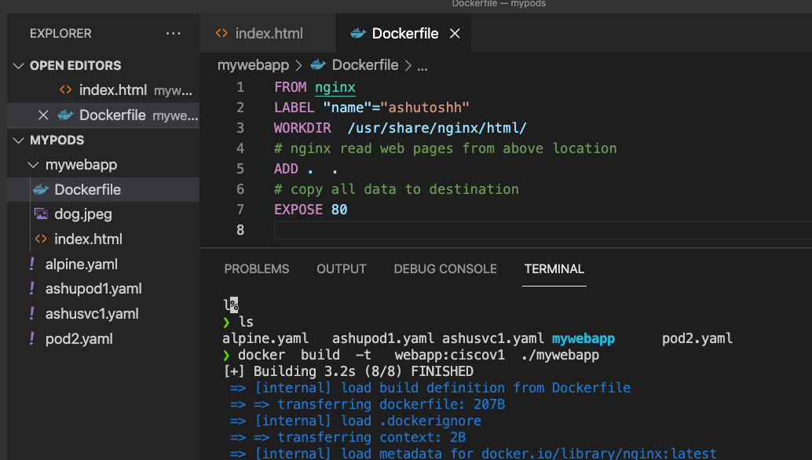

# Plan of traning and its execution 


## day3 revision 



## POD network policy rules 



## minikube cluster status 

```
❯ minikube status
❗  Executing "docker container inspect minikube --format={{.State.Status}}" took an unusually long time: 2.555876862s
💡  Restarting the docker service may improve performance.
minikube
type: Control Plane
host: Stopped
kubelet: Stopped
apiserver: Stopped
kubeconfig: Stopped

❯ minikube start
😄  minikube v1.21.0 on Darwin 11.4
🆕  Kubernetes 1.20.7 is now available. If you would like to upgrade, specify: --kubernetes-version=v1.20.7
✨  Using the docker driver based on existing profile
👍  Starting control plane node minikube in cluster minikube
🚜  Pulling base image ...
🔄  Restarting existing docker container for "minikube" ...


```

## Label 



### apply and checking labels in the POD 

```
❯ kubectl  get  po  --show-labels
NAME           READY   STATUS             RESTARTS   AGE     LABELS
ashupod123     1/1     Running            0          6m48s   x=helloashu
dipanjan1      1/1     Running            0          5m13s   x=hellodipanjan
himpod3        0/1     CrashLoopBackOff   5          3m46s   run=himpod3
sanjaypod2     1/1     Running            0          5m10s   <none>
sathyapod123   1/1     Running            0          5m55s   <none>
subhampod123   1/1     Running            0          6m21s   x=hellosubham
thirupod123    1/1     Running            0          4m47s   x=hellothiru
vritypod123    1/1     Running            0          5m17s   x=hellovrity
❯ kubectl  get  po  ashupod123   --show-labels
NAME         READY   STATUS    RESTARTS   AGE    LABELS
ashupod123   1/1     Running   0          7m5s   x=helloashu

```

### service type in k8s



## Nodeport 



### creating nodeport service

```
kubectl  create  service  nodeport  ashusvc1  --tcp 1234:80  --dry-run=client -o yaml  >ashusvc1.yaml

```

### deploying service 

```
❯ kubectl apply -f  ashusvc1.yaml
service/ashusvc1 created

```

### checking service

```
❯ kubectl   get   service
NAME           TYPE        CLUSTER-IP       EXTERNAL-IP   PORT(S)          AGE
ashusvc1       NodePort    10.98.222.227    <none>        1234:30461/TCP   31s
dipanjansvc1   NodePort    10.99.237.159    <none>        1234:32676/TCP   27s
himsv1         NodePort    10.100.165.218   <none>        1234:31666/TCP   7m35s
kubernetes     ClusterIP   10.96.0.1        <none>        443/TCP          25h
sanjusvc1      NodePort    10.101.146.139   <none>        1234:30623/TCP   26s
subhamsvc1     NodePort    10.106.153.8     <none>        1234:30132/TCP   12s
vrityc1        NodePort    10.101.98.154    <none>        1239:32071/TCP   31s
❯ kubectl   get   svc
NAME           TYPE        CLUSTER-IP       EXTERNAL-IP   PORT(S)          AGE
ashusvc1       NodePort    10.98.222.227    <none>        1234:30461/TCP   39s
dipanjansvc1   NodePort    10.99.237.159    <none>        1234:32676/TCP   35s
himsv1         NodePort    10.100.165.218   <none>        1234:31666/TCP   7m43s
kubernetes     ClusterIP   10.96.0.1        <none>        443/TCP          25h
sanjusvc1      NodePort    10.101.146.139   <none>        1234:30623/TCP   34s
subhamsvc1     NodePort    10.106.153.8     <none>        1234:30132/TCP   20s
thirusvc1      NodePort    10.103.176.24    <none>        1234:30128/TCP   4s
vrityc1        NodePort    10.101.98.154    <none>        1239:32071/TCP   39s

```

### deleting all service

```
❯ kubectl delete  svc  ashusvc1
service "ashusvc1" deleted
❯ kubectl delete  svc  --all
service "dipanjansvc1" deleted
service "hims2" deleted
service "himsv1" deleted
service "kubernetes" deleted
service "sanjusvc1" deleted
service "sathyasvc1" deleted
service "subhamsvc1" deleted
service "thirusvc1" deleted
service "vrityc1" deleted

```

### kubernetes dashboard accessing 




# Namespace concept 



## default namespaces in k8s



### kube-system namespaces 

```
❯ kubectl  get  pods  -n kube-system
NAME                                       READY   STATUS    RESTARTS   AGE
calico-kube-controllers-78d6f96c7b-gt7n9   1/1     Running   1          26h
calico-node-447cn                          1/1     Running   1          26h
calico-node-hc7cz                          1/1     Running   1          26h
calico-node-lkwbp                          1/1     Running   1          26h
coredns-558bd4d5db-6ppnj                   1/1     Running   1          26h
coredns-558bd4d5db-cld55                   1/1     Running   1          26h
etcd-master-node                           1/1     Running   1          26h
kube-apiserver-master-node                 1/1     Running   1          26h
kube-controller-manager-master-node        1/1     Running   1          26h
kube-proxy-7fgm8                           1/1     Running   1          26h
kube-proxy-xwqtp                           1/1     Running   1          26h
kube-proxy-zlfl6                           1/1     Running   1          26h
kube-scheduler-master-node                 1/1     Running   1          26h
metrics-server-6fb5c69669-zkkmr            1/1     Running   1          26h

```

### creating namespace

```
❯ kubectl  create  namespace  ashu-project
namespace/ashu-project created
❯ kubectl   get   ns
NAME                   STATUS   AGE
ashu-project           Active   2s
default                Active   26h
kube-node-lease        Active   26h
kube-public            Active   26h
kube-system            Active   26h
kubernetes-dashboard   Active   117m

```

### deleting all pods & services

```
❯ kubectl  delete all --all
pod "ashupod123" deleted
pod "dipanjan1" deleted
pod "himanshupod123" deleted
pod "sathyapod123" deleted
pod "subhampod123" deleted
pod "thirupod123" deleted
pod "vritypod123" deleted
service "ashusvc1" deleted
service "dipanjansvc1" deleted
service "hims2" deleted
service "kubernetes" deleted
service "sathyasvc1" deleted
service "subhamsvc1" deleted

```

### setting default namespaces 

```
❯ kubectl  config  set-context  --current --namespace=ashu-project
Context "kubernetes-admin@kubernetes" modified.
❯ 
❯ kubectl  config get-contexts
CURRENT   NAME                          CLUSTER      AUTHINFO           NAMESPACE
*         kubernetes-admin@kubernetes   kubernetes   kubernetes-admin   ashu-project
          minikube                      minikube     minikube           default

```


### POD to deployment 



## Deployment to app

### creating docker image



### pushing image quay registry 

```
❯ docker images
REPOSITORY                    TAG       IMAGE ID       CREATED              SIZE
webapp                        ciscov1   36ac73f77b92   About a minute ago   133MB
httpd                         cgiv1     b95116c9fdbf   2 days ago           287MB
quay.io/redashu/httpd         cgiv1     b95116c9fdbf   2 days ago           287MB
dockerashu/httpd              cgiv1     7dd624710447   2 days ago           287MB
mariadb                       latest    6d5c5ed114ad   6 days ago           408MB
nginx                         latest    4f380adfc10f   8 days ago           133MB
gcr.io/k8s-minikube/kicbase   v0.0.22   bcd131522525   8 weeks ago          1.09GB
centos                        latest    300e315adb2f   6 months ago         209MB
❯ docker  tag  webapp:ciscov1   quay.io/redashu/webapp:ciscov1
❯ docker login  quay.io
Authenticating with existing credentials...
Login Succeeded
❯ docker  push quay.io/redashu/webapp:ciscov1
The push refers to repository [quay.io/redashu/webapp]
7123f09fcf16: Pushed 
5f70bf18a086: Pushed 
c6d74dcb7fe7: Pushed 
b50a193ebf2e: Pushed 
165eb6c3c0d3: Pushed 
cf388fcf3527: Pushed 
2418679ca01f: Pushed 
764055ebc9a7: Pushed 
ciscov1: digest: sha256:c1fbf022f35f1b0be9fd0aa65a6311339adfbbaded5eee6752766704a7edda96 size: 1985
❯ docker logout quay.io
Removing login credentials for quay.io

```

### creating deployment 

```
kubectl create  deployment  ashuweb  --image=quay.io/redashu/webapp:ciscov1  --dry-run=client -o yaml   >mydeploy.yaml
```

### deploy

```
❯ kubectl apply -f mydeploy.yaml
deployment.apps/ashuweb created
```

###

```

034* kubectl create  deployment  ashuweb  --image=quay.io/redashu/webapp:ciscov1  --dry-run=client -o yaml   >mydeploy.yaml
10035  history
10036* ls
10037* kubectl apply -f mydeploy.yaml
10038  kubectl  get  deployment
10039  kubectl  get  deploy
10040  kubectl  get  po 
10041  kubectl apply -f mydeploy.yaml
10042  kubectl  get  po 
10043* kubectl replace -f mydeploy.yaml  --force
10044  kubectl  get  deploy
10045  kubectl  get  po 
❯ kubectl  get  deploy
NAME      READY   UP-TO-DATE   AVAILABLE   AGE
ashuweb   1/1     1            1           52s
❯ kubectl  get  po
NAME                       READY   STATUS    RESTARTS   AGE
ashuweb-7bb887d869-r8rt2   1/1     Running   0          57s

```

