# Plan of traning and its execution 

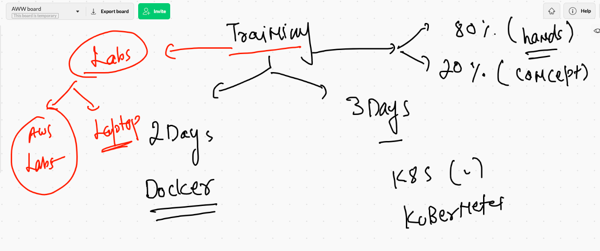

## Pre-requisite 

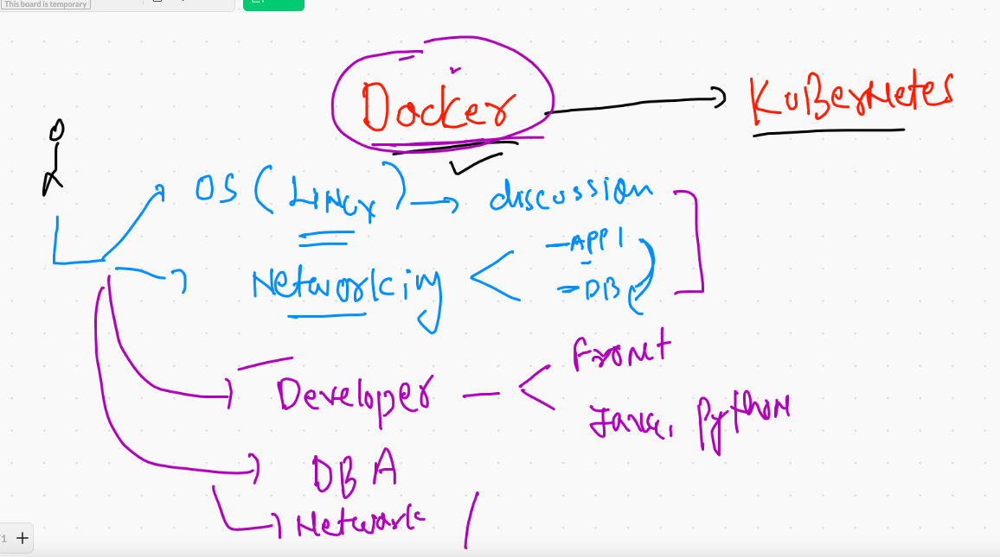

## App deployment history 

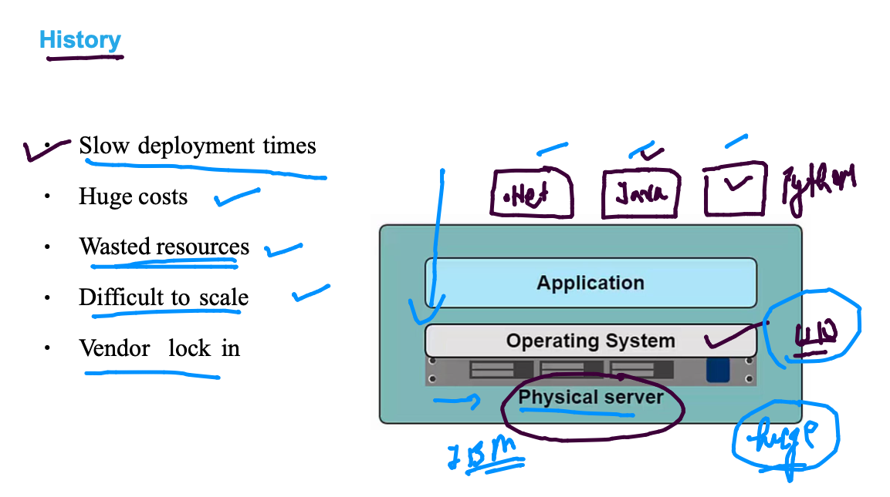

## moving from base OS to Virtualization concept 

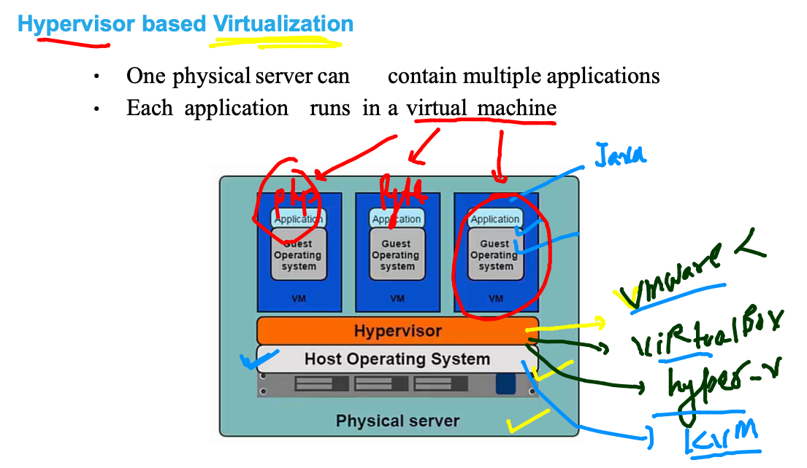

## APp platform are not using entire OS libraries and apps

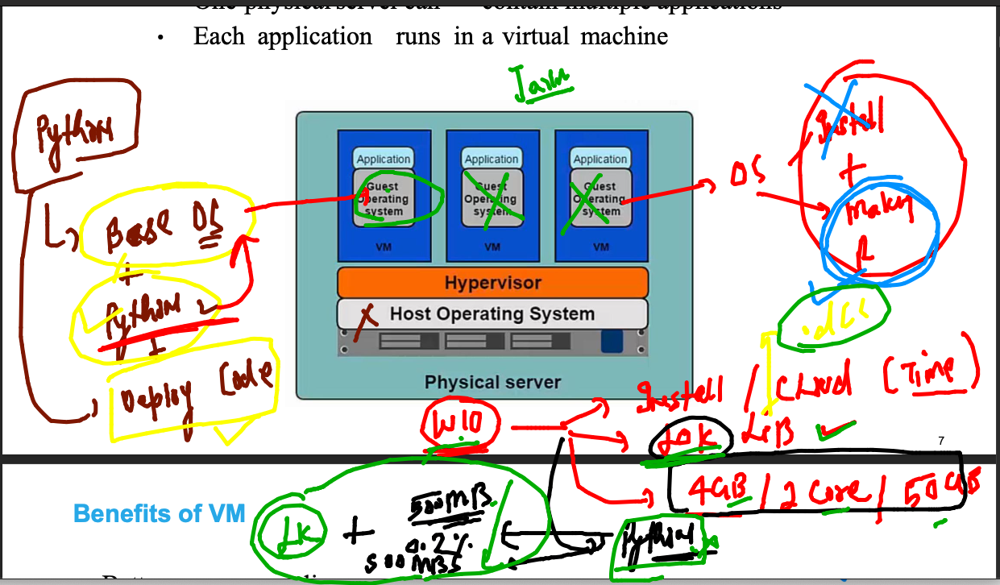

## OS BASIC 

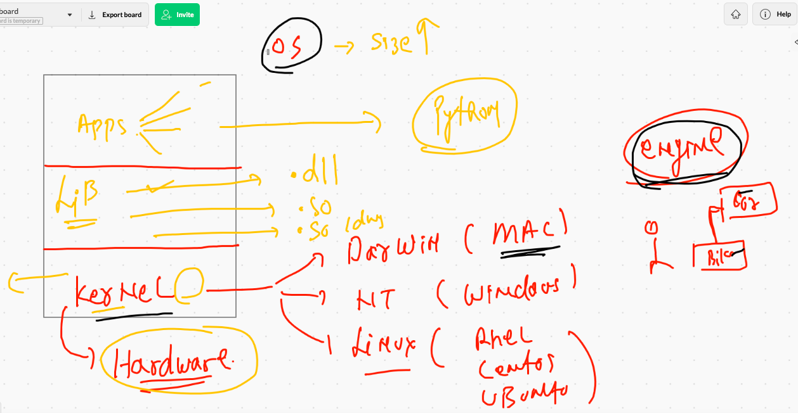

## Vm VS  containers

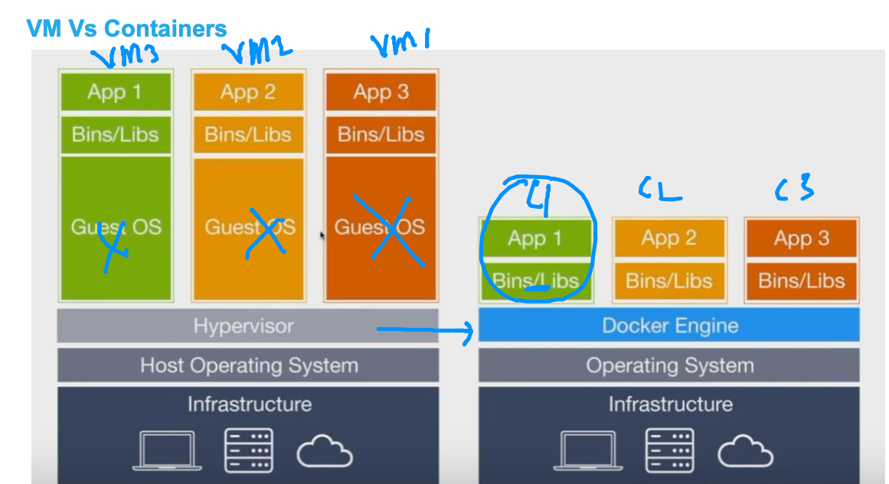

## Hypervisor vs CRE 

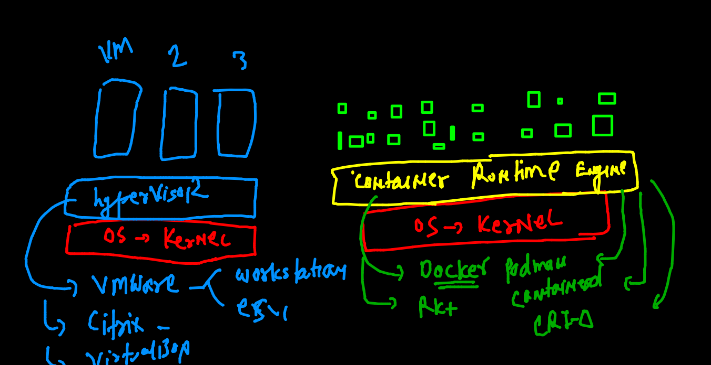

# Getting started with Docker 

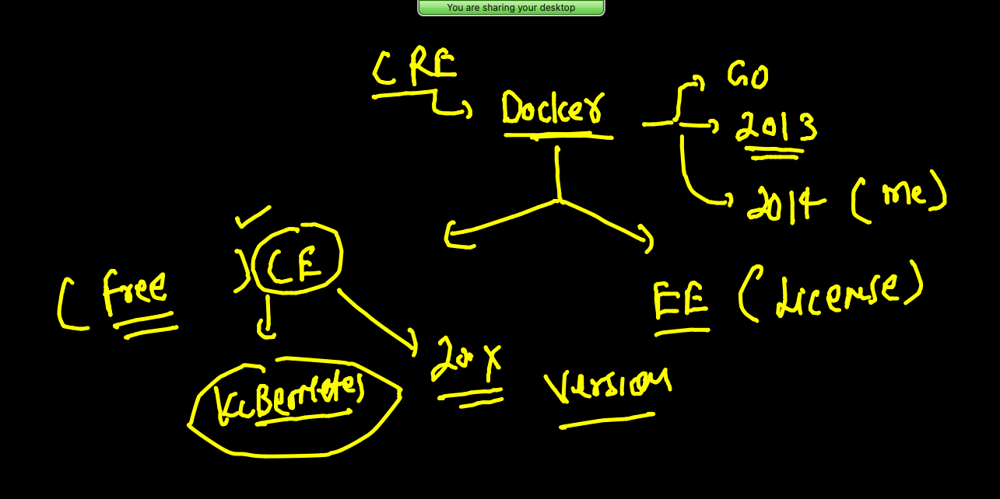

## Docker ce 

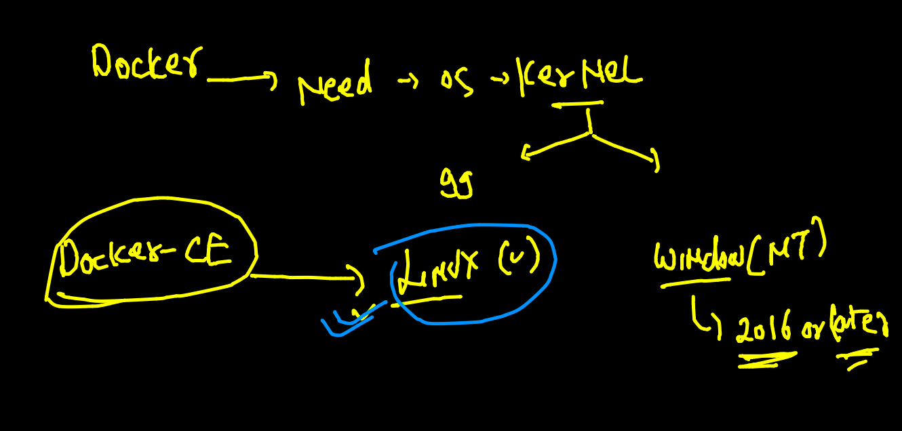

## Docker ce installation 

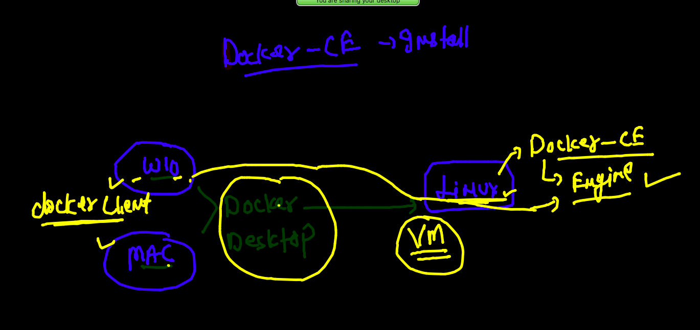

