# Plan of traning and its execution 


## more about CRE

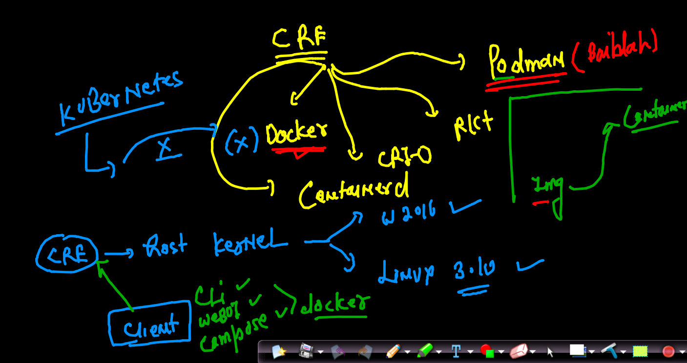

## More on containers 

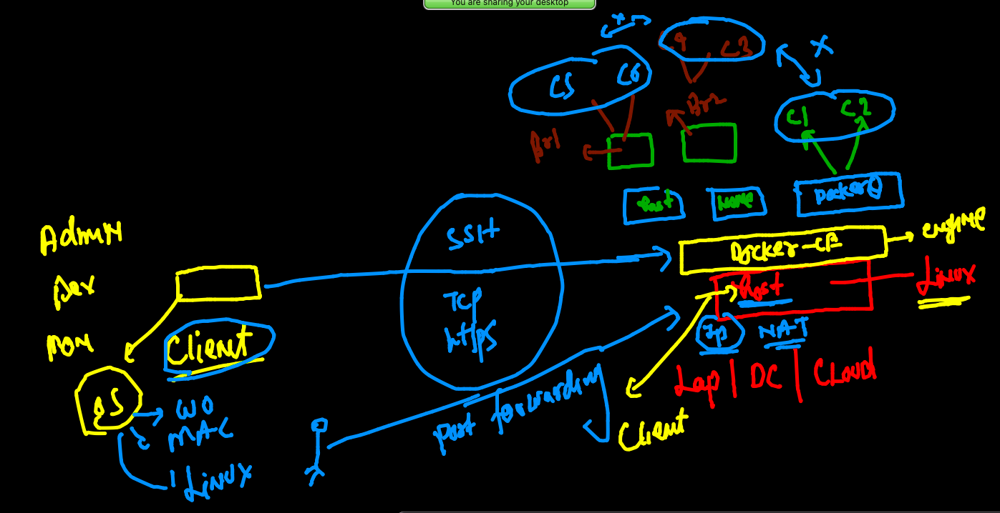

## A glimpse to java web and deploying in tomcat 

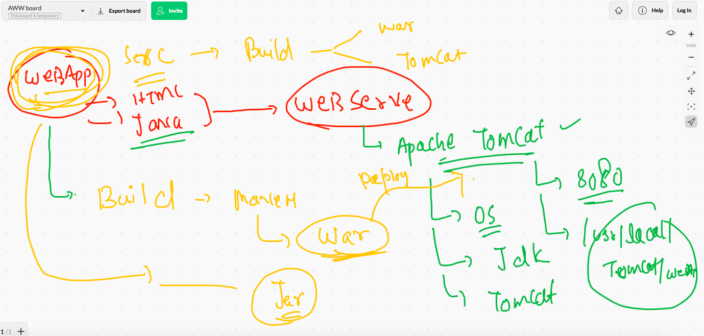

### BUilding javaweb 

```
[niket@ip-172-31-75-82 mydockerimages]$ docker  build -t  ciscojavaweb:v1  ./javawebapp  
Sending build context to Docker daemon  231.4kB
Step 1/6 : FROM tomcat
latest: Pulling from library/tomcat
0bc3020d05f1: Already exists 
a110e5871660: Already exists 
83d3c0fa203a: Already exists 
a8fd09c11b02: Already exists 
96ebf1506065: Pull complete 
b8bf70f9cc4d: Pull complete 
3f6da67b9e68: Pull complete 
257407776119: Pull complete 
541802ef66b7: Pull complete 
1e119b3654ab: Pull complete 
Digest: sha256:d0e769cea1684c065bb6a2e52f13cd5d7138a19a5ef3c16828f32e9bd8323f56
Status: Downloaded newer image for tomcat:latest
 ---> b0bf9a4a7c93
 
 ```
 
 ### creating container 
 
 ```
  docker run -itd --name ashujc1 -p 4466:8080 --memory 200m --cpu-shares=30  a90319d67c32 
24f1c23bf126ad70554df44216086f8f37608bd3643e094a9ac954012811f710
[niket@ip-172-31-75-82 mydockerimages]$ docker  ps
CONTAINER ID   IMAGE          COMMAND             CREATED         STATUS         PORTS                    NAMES
24f1c23bf126   a90319d67c32   "catalina.sh run"   4 seconds ago   Up 3 seconds   0.0.0.0:4466->8080/tcp   ashujc1

```

## pushing image registry to quay 

### tag

```
docker  tag  ciscojavawebapp:v1    quay.io/redashu/javawebapp:ciscoday3 
```

### login 

```
docker  login   quay.io  

```

### pushing and logout 

```
niket@ip-172-31-75-82 mydockerimages]$ docker  push  quay.io/redashu/javawebapp:ciscoday3
The push refers to repository [quay.io/redashu/javawebapp]
7dc3bf71a2aa: Pushed 
d5163f196403: Pushed 
eb671b209e8d: Pushed 
9dfdabdf2745: Pushed 
b59bec8e9230: Pushed 
6ea995e9b7d3: Pushed 


[niket@ip-172-31-75-82 mydockerimages]$ docker  logout   quay.io  
Removing login credentials for quay.io

```

## COntainer orchestration problems 

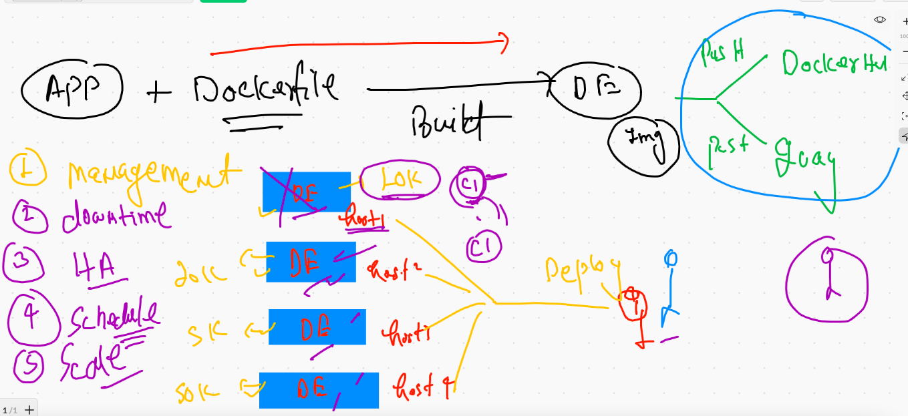

## COntainer Orchestration engine 

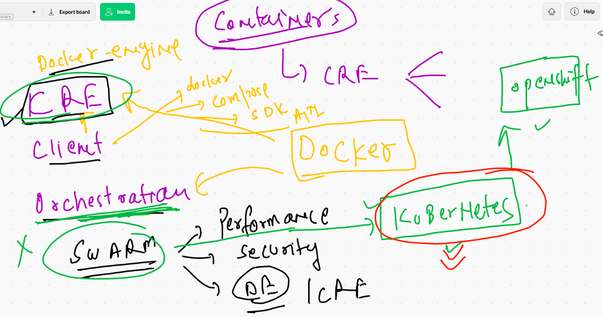

## Kubernetes everywhere 

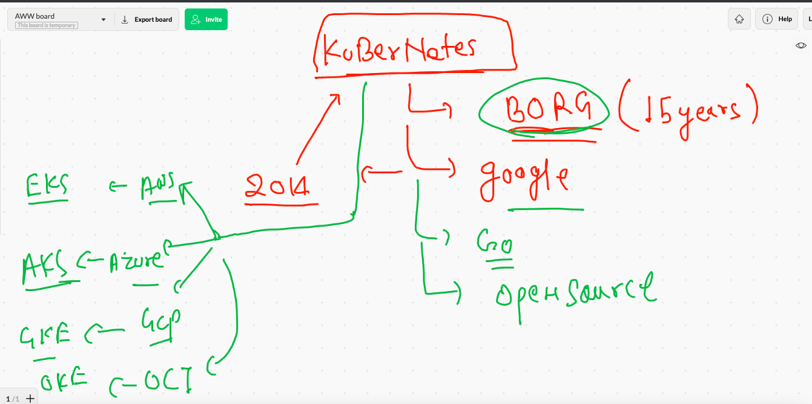

# Kubernetes getting started

## Level 1 arch 

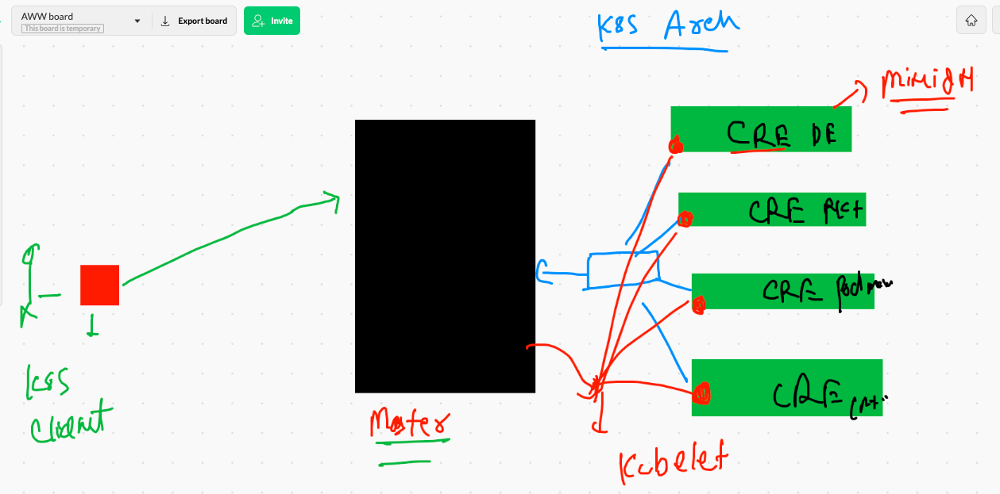

## Kube-apiserver

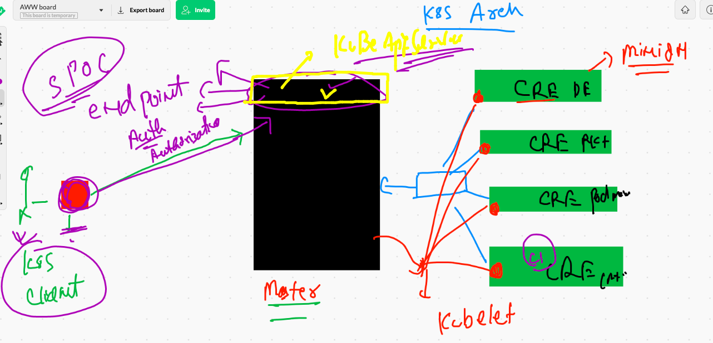


## KUbernetes client 

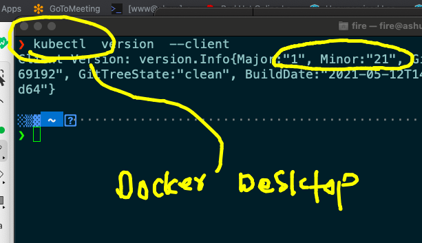

### sharing token a auth file with clients 

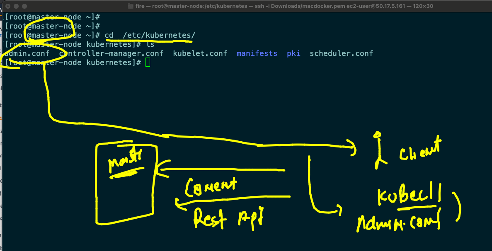

### FRom client connecting to kubernetes master API server  

```
❯ cd  Desktop
❯ ls
DevopsSRE     admin.conf    auth.png      carch.png     helm2         k8s1.png      linksdex.txt  techienest
PHD           apis.png      backup        ciscojune28th k8s.png       kubectl.png   orch.png      webapp_dev
❯ kubectl  cluster-info   --kubeconfig  admin.conf
Kubernetes control plane is running at https://50.17.5.161:6443
CoreDNS is running at https://50.17.5.161:6443/api/v1/namespaces/kube-system/services/kube-dns:dns/proxy

To further debug and diagnose cluster problems, use 'kubectl cluster-info dump'.
❯ 
❯ kubectl  version    --kubeconfig  admin.conf
Client Version: version.Info{Major:"1", Minor:"21", GitVersion:"v1.21.1", GitCommit:"5e58841cce77d4bc13713ad2b91fa0d961e69192", GitTreeState:"clean", BuildDate:"2021-05-12T14:18:45Z", GoVersion:"go1.16.4", Compiler:"gc", Platform:"darwin/amd64"}
Server Version: version.Info{Major:"1", Minor:"21", GitVersion:"v1.21.2", GitCommit:"092fbfbf53427de67cac1e9fa54aaa09a28371d7", GitTreeState:"clean", BuildDate:"2021-06-16T12:53:14Z", GoVersion:"go1.16.5", Compiler:"gc", Platform:"linux/amd64"}
❯ kubectl  get nodes    --kubeconfig  admin.conf
NAME          STATUS   ROLES                  AGE    VERSION
master-node   Ready    control-plane,master   166m   v1.21.2
minion1       Ready    <none>                 166m   v1.21.2
minion2       Ready    <none>                 165m   v1.21.2

```

### setting config file in MAC 

```
❯ whoami
fire
❯ 
❯ cd  ~
❯ pwd
/Users/fire
❯ cd  .kube
❯ ls
cache                  config                 http-cache             kubectl_autocompletion storage
❯ rm  config
❯ cp  -v  ~/Desktop/admin.conf   ~/.kube/config
/Users/fire/Desktop/admin.conf -> /Users/fire/.kube/config
❯ /Users/fire/.kube
❯ kubectl  get  nodes
NAME          STATUS   ROLES                  AGE    VERSION
master-node   Ready    control-plane,master   174m   v1.21.2
minion1       Ready    <none>                 173m   v1.21.2
minion2       Ready    <none>                 173m   v1.21.2

```

### kube-schedular 

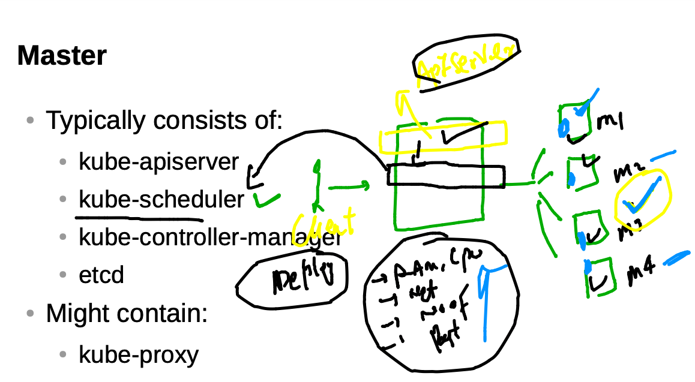


### node controller 

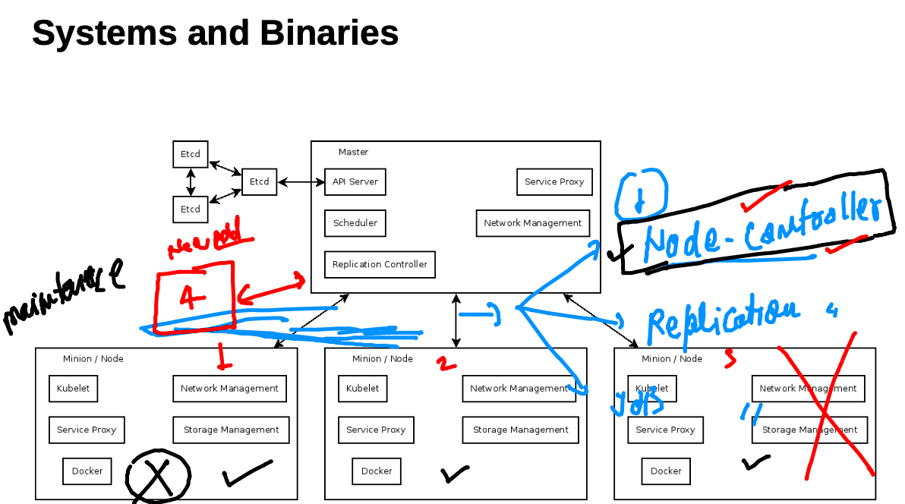

### Replication controller 

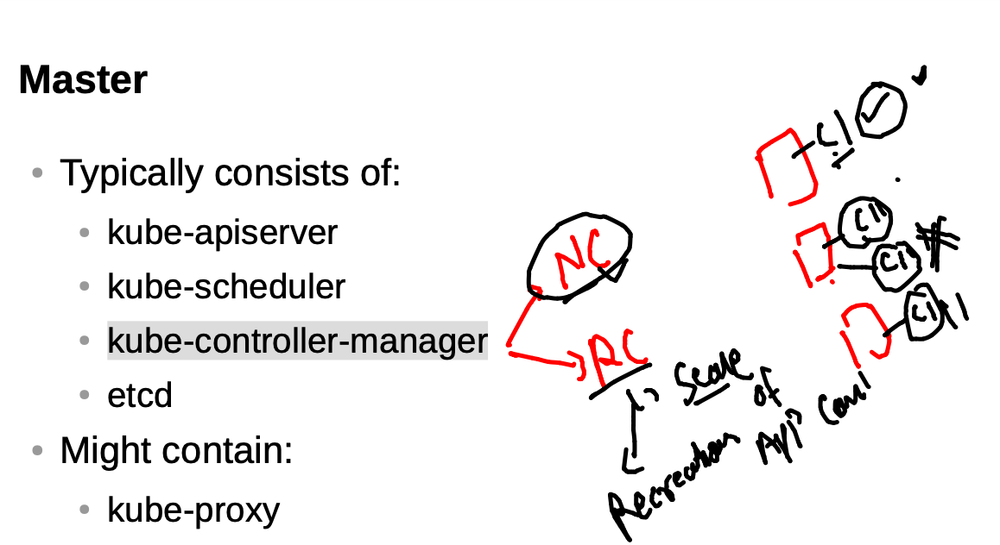


### k8s cluster deployment 

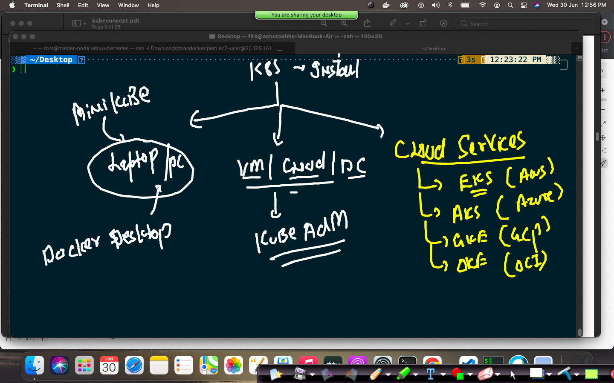

## TO deploy k8s cluster in Lap / pc 

### Installing minikube 

```
❯ curl -LO https://storage.googleapis.com/minikube/releases/latest/minikube-darwin-amd64
  % Total    % Received % Xferd  Average Speed   Time    Time     Time  Current
                                 Dload  Upload   Total   Spent    Left  Speed
100 60.4M  100 60.4M    0     0  5701k      0  0:00:10  0:00:10 --:--:-- 5872k
❯ sudo install minikube-darwin-amd64 /usr/local/bin/minikube
Password:
❯ minikube version
minikube version: v1.21.0
commit: 76d74191d82c47883dc7e1319ef7cebd3e00ee11

```

### Installing. k8s cluster using minikube 

```
❯ minikube  start  --driver=docker
😄  minikube v1.21.0 on Darwin 11.4
🆕  Kubernetes 1.20.7 is now available. If you would like to upgrade, specify: --kubernetes-version=v1.20.7
✨  Using the docker driver based on existing profile
👍  Starting control plane node minikube in cluster minikube
🚜  Pulling base image ...
🤷  docker "minikube" container is missing, will recreate.
🔥  Creating docker container (CPUs=2, Memory=1988MB) ...
🐳  Preparing Kubernetes v1.20.2 on Docker 20.10.6 ...
🔎  Verifying Kubernetes components...
    ▪ Using image gcr.io/k8s-minikube/storage-provisioner:v5
🌟  Enabled addons: storage-provisioner, default-storageclass
🏄  Done! kubectl is now configured to use "minikube" cluster and "default" namespace by default

```

## COncept of context to check cluster 

```
❯ kubectl   config  get-contexts
CURRENT   NAME                          CLUSTER      AUTHINFO           NAMESPACE
          kubernetes-admin@kubernetes   kubernetes   kubernetes-admin   
*         minikube                      minikube     minikube           default

░▒▓ ~/Desktop ····················································································· 02:31:16 PM ▓▒░─╮
❯                     


```

### checking nodes

```
❯ kubectl  get  nodes
NAME       STATUS   ROLES                  AGE   VERSION
minikube   Ready    control-plane,master   23d   v1.20.2

```

### switching context to switch cluster

```
❯ kubectl  config  use-context  kubernetes-admin@kubernetes
Switched to context "kubernetes-admin@kubernetes".
❯ kubectl   config  get-contexts
CURRENT   NAME                          CLUSTER      AUTHINFO           NAMESPACE
*         kubernetes-admin@kubernetes   kubernetes   kubernetes-admin   
          minikube                      minikube     minikube           default
❯ kubectl  get  nodes
NAME          STATUS   ROLES                  AGE    VERSION
master-node   Ready    control-plane,master   5h9m   v1.21.2
minion1       Ready    <none>                 5h8m   v1.21.2
minion2       Ready    <none>                 5h8m   v1.21.2


```

### Deploying application in k8s 

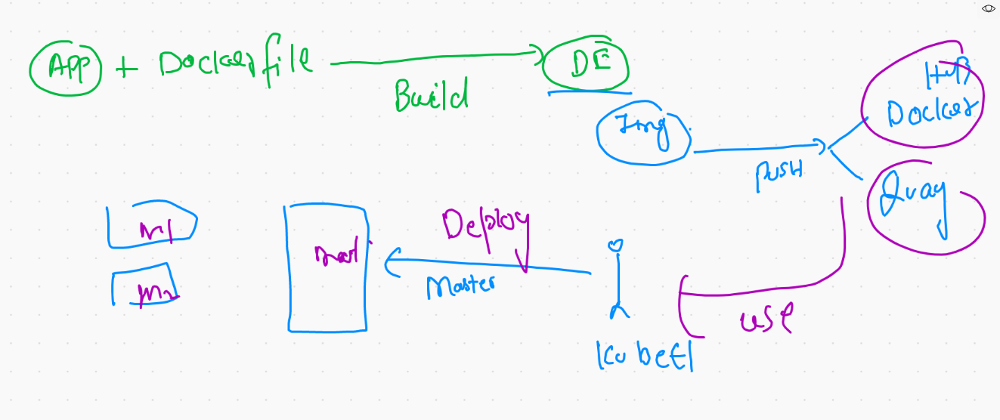

## COntainer vs POD 

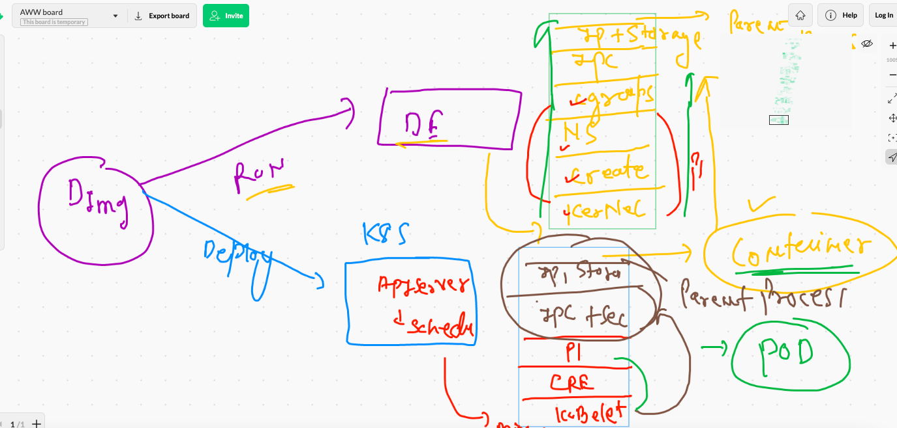

### deploying pods 

```
❯ kubectl  apply -f  ashupod1.yaml --dry-run=client
pod/ashupod123 created (dry run)
❯ kubectl  apply -f  ashupod1.yaml
pod/ashupod123 created
❯ kubectl  get  po
NAME         READY   STATUS    RESTARTS   AGE
ashupod123   1/1     Running   0          41s

```

### Minion checked 

```
❯ kubectl  get  nodes
NAME          STATUS   ROLES                  AGE     VERSION
master-node   Ready    control-plane,master   5h55m   v1.21.2
minion1       Ready    <none>                 5h54m   v1.21.2
minion2       Ready    <none>                 5h54m   v1.21.2
❯ kubectl  get  po
NAME             READY   STATUS    RESTARTS   AGE
ashupod123       1/1     Running   0          15m
dipanjan1        1/1     Running   0          11m
himanshupod123   1/1     Running   0          2m
sanjaypod123     1/1     Running   0          12m
sathyapod123     1/1     Running   0          12m
subhampod123     1/1     Running   0          9m17s
thirupod123      1/1     Running   0          9m37s
vritypod123      1/1     Running   0          4m21s
❯ kubectl  get  pod   ashupod123  -o wide
NAME         READY   STATUS    RESTARTS   AGE   IP                NODE      NOMINATED NODE   READINESS GATES
ashupod123   1/1     Running   0          15m   192.168.179.195   minion2   <none>           <none>


```

### POd info 

```
❯ kubectl  get  pod    -o wide
NAME             READY   STATUS    RESTARTS   AGE     IP                NODE      NOMINATED NODE   READINESS GATES
ashupod123       1/1     Running   0          16m     192.168.179.195   minion2   <none>           <none>
dipanjan1        1/1     Running   0          13m     192.168.179.196   minion2   <none>           <none>
himanshupod123   1/1     Running   0          3m37s   192.168.34.6      minion1   <none>           <none>
sanjaypod123     1/1     Running   0          14m     192.168.34.4      minion1   <none>           <none>
sathyapod123     1/1     Running   0          14m     192.168.34.3      minion1   <none>           <none>
subhampod123     1/1     Running   0          10m     192.168.34.5      minion1   <none>           <none>
thirupod123      1/1     Running   0          11m     192.168.179.197   minion2   <none>           <none>
vritypod123      1/1     Running   0          5m58s   192.168.179.198   minion2   <none>           <none>

```

### Generating YAML file 

```
 kubectl  run  ashupod2  --image=dockerashu/httpd:ashuciscov111  --port=80 --dry-run=client  -o yaml
apiVersion: v1
kind: Pod
metadata:
  creationTimestamp: null
  labels:
    run: ashupod2
  name: ashupod2
spec:
  containers:
  - image: dockerashu/httpd:ashuciscov111
    name: ashupod2
    ports:
    - containerPort: 80
    resources: {}
  dnsPolicy: ClusterFirst
  restartPolicy: Always
status: {}
❯ kubectl  run  ashupod2  --image=dockerashu/httpd:ashuciscov111  --port=80 --dry-run=client  -o yaml >pod2.yaml
```

### Deleting pods 

```
❯ kubectl  delete  pod ashupod123
pod "ashupod123" deleted
❯ kubectl  delete  pod --all
pod "ashupod2" deleted
pod "dipanjan1" deleted
pod "himanshupod123" deleted
pod "himpod3" deleted
pod "sanjaypod123" deleted
pod "sanjupod2" deleted

```

### creating alpine yaml

```
❯ kubectl  run   ashupod3  --image=alpine  --dry-run=client -o yaml
apiVersion: v1
kind: Pod
metadata:
  creationTimestamp: null
  labels:
    run: ashupod3
  name: ashupod3
spec:
  containers:
  - image: alpine
    name: ashupod3
    resources: {}
  dnsPolicy: ClusterFirst
  restartPolicy: Always
status: {}
❯ kubectl  run   ashupod3  --image=alpine  --dry-run=client -o yaml  >alpine.yaml
```

### custom parent process 


##

```
❯ kubectl replace  -f  alpine.yaml  --force
pod "ashupod3" deleted
pod/ashupod3 replaced
❯ kubectl  get  po
NAME         READY   STATUS             RESTARTS   AGE
ashupod3     1/1     Running            0          33s

```

### checking logs of pod

```
 kubectl  logs  -f  ashupod3 
 
```

### login into container running inside POD 

```
❯ kubectl  get  po
NAME         READY   STATUS    RESTARTS   AGE
ashupod3     1/1     Running   0          2m21s
dipanjan1    1/1     Running   0          31s
subhampod3   1/1     Running   0          118s
thirupod3    1/1     Running   0          67s
❯ kubectl  exec  -it  ashupod3  -- sh
/ # 
/ # 
/ # 
/ # 
/ # exit
❯ kubectl  exec  -it  ashupod3  -- sh
/ # uname
Linux
/ # cat  /etc/os-release 
NAME="Alpine Linux"
ID=alpine
VERSION_ID=3.14.0
PRETTY_NAME="Alpine Linux v3.14"
HOME_URL="https://alpinelinux.org/"
BUG_REPORT_URL="https://bugs.alpinelinux.org/"
/ # exit

```

## Container networking 


## describing POD 

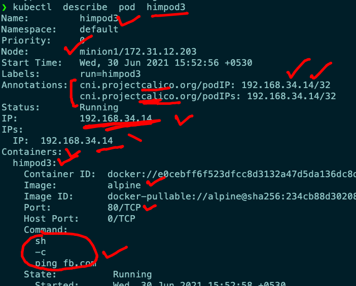

## port-forwarding options to access app running inthe POD 

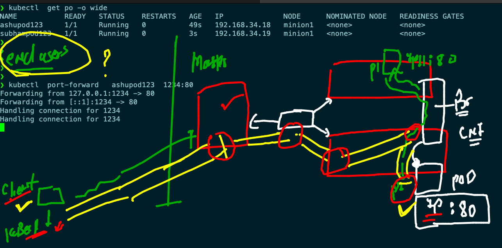

### port forwarding 

```
❯ kubectl  port-forward   ashupod123  1234:80
Forwarding from 127.0.0.1:1234 -> 80
Forwarding from [::1]:1234 -> 80
Handling connection for 1234
Handling connection for 1234

```

## Introduction to service in k8s

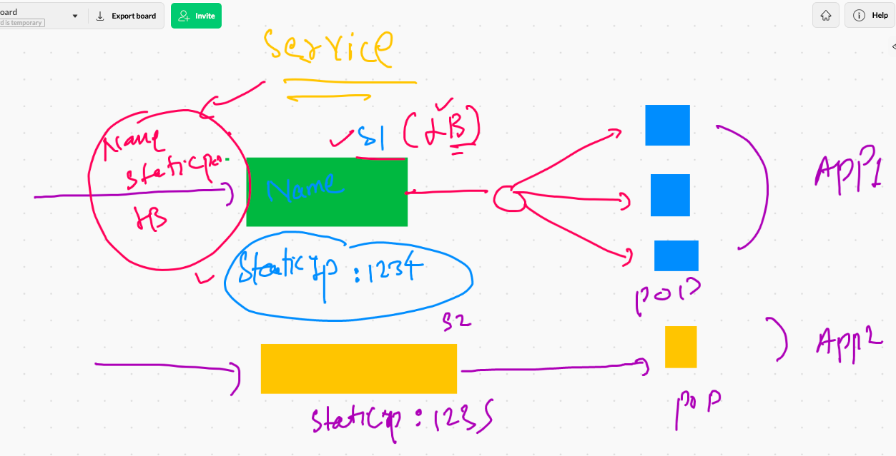

## service label concept 

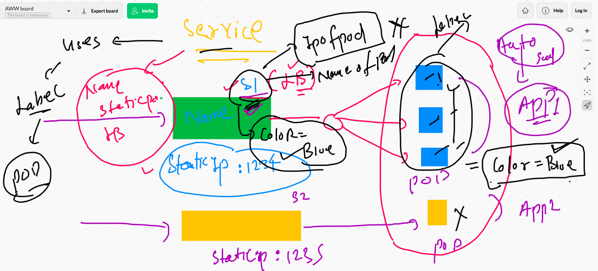


