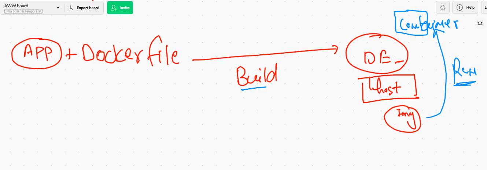
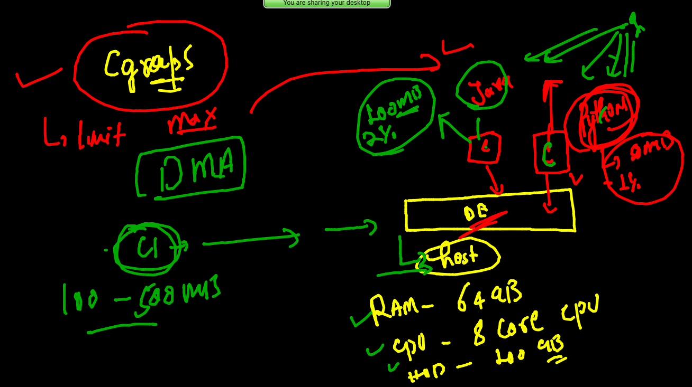

# Plan of traning and its execution 


## Day1 summary 


## docker BUild and RUn 




### trick to remove all containers

```
[niket@ip-172-31-75-82 mydockerimages]$ docker rm $(docker ps -aq) 
4e72f1ff42c3
635ced1c463c
3f9ebd843530

```

## COntainerization of webapps

### webapplication server 


### apache httpd 


### Sample front end web app -- containerization 

```
git clone https://github.com/mdn/beginner-html-site-styled
Cloning into 'beginner-html-site-styled'...
remote: Enumerating objects: 40, done.
remote: Total 40 (delta 0), reused 0 (delta 0), pack-reused 40
Unpacking objects: 100% (40/40), done.
[niket@ip-172-31-75-82 mydockerimages]$ ls
beginner-html-site-styled  javaimg  pythonimg  webappimg

```

### CMD vs ENTRYPOINT 


### building docker images

```
niket@ip-172-31-75-82 mydockerimages]$ cd  beginner-html-site-styled/
[niket@ip-172-31-75-82 beginner-html-site-styled]$ ls
CODE_OF_CONDUCT.md  Dockerfile  images  index.html  LICENSE  README.md  styles
[niket@ip-172-31-75-82 beginner-html-site-styled]$ docker  build  -t  httpd:ashuciscov111 . 
Sending build context to Docker daemon  63.49kB
Step 1/5 : FROM centos
 ---> 300e315adb2f
Step 2/5 : LABEL  "email"="ashutoshh@linux.com"
 ---> Using cache
 ---> 83aa7c630448
Step 3/5 : RUN  yum install httpd -y
 ---> Running in d047a579504c
CentOS Linux 8 - AppStream                       38 MB/s | 7.5 MB     00:00    
CentOS Linux 8 - BaseOS                          15 MB/s | 2.6 MB     00:00    
CentOS Linux 8 - Extras                          89 kB/s | 9.6 kB     00:00    
Dependencies resolved.
=========================================

```

## creating container 

```
docker run -tid --name x1 -p 1234:80 httpd:ashuciscov111 
```


## INtro to Cgroups 




### checking docker host machine resources  and other info 

```
niket@ip-172-31-75-82 mydockerimages]$ docker  info  
Client:
 Context:    default
 Debug Mode: false

Server:
 Containers: 13
  Running: 8
  Paused: 0
  Stopped: 5
 Images: 125
 Server Version: 20.10.4
 Storage Driver: overlay2
  Backing Filesystem: xfs
  Supports d_type: true
  Native Overlay Diff: true
 Logging Driver: json-file
 Cgroup Driver: cgroupfs
 Cgroup Version: 1
 Plugins:
 
 ```
 
 ### checking docker stats
 
 ```
 docker stats 
 ----
 CONTAINER ID   NAME          CPU %     MEM USAGE / LIMIT    MEM %     NET I/O           BLOCK I/O    PIDS
bcce9ac3a771   webapp        0.06%     18.56MiB / 7.69GiB   0.24%     1kB / 0B          0B / 0B      213
5aa367e87118   him2httpd     0.07%     23.12MiB / 7.69GiB   0.29%     6.58kB / 61kB     0B / 0B      278
bc800694204c   vritywebc1    0.09%     23.19MiB / 7.69GiB   0.29%     7.31kB / 60.7kB   0B / 0B      278
a650cb63f8a9   DipanjanWeb   0.09%     23.2MiB / 7.69GiB    0.29%     4.31kB / 60.5kB   0B / 0B      278
7b173edc43f3   sathyac1      0.08%     23.31MiB / 7.69GiB   0.30%     7.52kB / 61.5kB   0B / 0B      278
e9e3f51d788d   sanju1        0.08%     23.25MiB / 7.69GiB   0.30%     7.11kB / 61kB     0B / 0B      278
e35dce4fd920   subhamc1      0.08%     23.45MiB / 7.69GiB   0.30%     9.33kB / 121kB    0B / 0B      278
092925605fb0   ashuc1        0.08%     24.02MiB / 7.69GiB   0.31%     18.5kB / 242kB    958kB / 0B   278


```

### container with cgroups limit

```
docker  run -tid --name ashuc2  -p 1188:80  --memory=100m   --cpu-shares=30  httpd:ashuciscov111 

```

## COntainer Bridge 


### connecting containers 

```
[niket@ip-172-31-75-82 mydockerimages]$ docker  exec -it  ashuc1  sh 
/ # 
/ # ifconfig 
eth0      Link encap:Ethernet  HWaddr 02:42:AC:11:00:02  
          inet addr:172.17.0.2  Bcast:172.17.255.255  Mask:255.255.0.0
          UP BROADCAST RUNNING MULTICAST  MTU:1500  Metric:1
          RX packets:151 errors:0 dropped:0 overruns:0 frame:0
          TX packets:133 errors:0 dropped:0 overruns:0 carrier:0
          collisions:0 txqueuelen:0 
          RX bytes:13750 (13.4 KiB)  TX bytes:12522 (12.2 KiB)

lo        Link encap:Local Loopback  
          inet addr:127.0.0.1  Mask:255.0.0.0
          UP LOOPBACK RUNNING  MTU:65536  Metric:1
          RX packets:0 errors:0 dropped:0 overruns:0 frame:0
          TX packets:0 errors:0 dropped:0 overruns:0 carrier:0
          collisions:0 txqueuelen:1000 
          RX bytes:0 (0.0 B)  TX bytes:0 (0.0 B)

/ # ping  172.17.0.3
PING 172.17.0.3 (172.17.0.3): 56 data bytes
64 bytes from 172.17.0.3: seq=0 ttl=255 time=0.165 ms
64 bytes from 172.17.0.3: seq=1 ttl=255 time=0.090 ms
64 bytes from 172.17.0.3: seq=2 ttl=255 time=0.091 ms
^C
--- 172.17.0.3 ping statistics ---
3 packets transmitted, 3 packets received, 0% packet loss
round-trip min/avg/max = 0.090/0.115/0.165 ms
/ # 

```

### more container operations 

```
niket@ip-172-31-75-82 mydockerimages]$ docker   inspect  ashuc1   --format='{{.NetworkSettings.IPAddress}}'
172.17.0.2
[niket@ip-172-31-75-82 mydockerimages]$ docker  ps
CONTAINER ID   IMAGE     COMMAND             CREATED         STATUS         PORTS     NAMES
5df056fdcce5   alpine    "ping fb.com"       4 minutes ago   Up 4 minutes             thv1
6795998526ad   alpine    "ping fb.com"       5 minutes ago   Up 5 minutes             vrityc1
4501deaea562   alpine    "ping fb.com"       5 minutes ago   Up 5 minutes             sanju1
62a598bcd2ff   alpine    "ping fb.com"       5 minutes ago   Up 5 minutes             Dipanjan1
8d2e3dc48939   alpine    "ping fb.com"       5 minutes ago   Up 5 minutes             sathyac1
377e00812904   alpine    "ping google.com"   5 minutes ago   Up 5 minutes             himanshu
421d180a6903   alpine    "ping google.com"   5 minutes ago   Up 5 minutes             subhamc1
5cb9f7e5aa0b   alpine    "ping fb.com"       6 minutes ago   Up 6 minutes             ashuc1
[niket@ip-172-31-75-82 mydockerimages]$ docker   inspect  thv1  --format='{{.NetworkSettings.IPAddress}}'
172.17.0.9
[niket@ip-172-31-75-82 mydockerimages]$ docker   inspect  vrityc1  --format='{{.NetworkSettings.IPAddress}}'
172.17.0.8
[niket@ip-172-31-75-82 mydockerimages]$ docker  exec -it ashuc1 sh 
/ # ping 172.17.0.9
PING 172.17.0.9 (172.17.0.9): 56 data bytes
64 bytes from 172.17.0.9: seq=0 ttl=255 time=0.150 ms
64 bytes from 172.17.0.9: seq=1 ttl=255 time=0.114 ms
^C
--- 172.17.0.9 ping statistics ---
2 packets transmitted, 2 packets received, 0% packet loss
round-trip min/avg/max = 0.114/0.132/0.150 ms
/ # exit

```

### NAT


### create static bridge

```
niket@ip-172-31-75-82 mydockerimages]$ docker  network ls
NETWORK ID     NAME      DRIVER    SCOPE
856e80a9ba74   bridge    bridge    local
11897ad294d1   host      host      local
7daac5c249e1   none      null      local
[niket@ip-172-31-75-82 mydockerimages]$ docker  network  create  ashubr1 
8aeb53891bdb39920cd6a8dc4657add0bb18eabe381f5ed14382e6778ee58c7f
[niket@ip-172-31-75-82 mydockerimages]$ docker  network ls
NETWORK ID     NAME      DRIVER    SCOPE
8aeb53891bdb   ashubr1   bridge    local
856e80a9ba74   bridge    bridge    local
11897ad294d1   host      host      local
7daac5c249e1   none      null      local
[niket@ip-172-31-75-82 mydockerimages]$

```

### inspecting info

```
[niket@ip-172-31-75-82 mydockerimages]$ docker  network   inspect  ashubr1
[
    {
        "Name": "ashubr1",
        "Id": "8aeb53891bdb39920cd6a8dc4657add0bb18eabe381f5ed14382e6778ee58c7f",
        "Created": "2021-06-29T07:06:18.040338749Z",
        "Scope": "local",
        "Driver": "bridge",
        "EnableIPv6": false,
        "IPAM": {
            "Driver": "default",
            "Options": {},
            "Config": [
                {
                    "Subnet": "172.18.0.0/16",
                    "Gateway": "172.18.0.1"
                }
            ]
        },
        
  ```
    
  ### creating bridge and contaienrs
    
  ```
  
  1  docker  network  ls
   72  docker  network   inspect  856e80a9ba74 
   73  docker  network ls
   74  docker  run -it --rm --network  none alpine sh 
   75  docker  run -itd  --name xx11  --network  none alpine sh 
   76  docker  exec -it  xx11 sh 
   77  docker  network  connect  856e80a9ba74  xx11
   78  history 
   79  docker  network  connect  856e80a9ba74  xx11
   80  docker  update --help
   81  history 
   82  docker  network ls
   83  docker  network  create  ashubr1 
   84  docker  network ls
   85  docker  network   inspect  ashubr1
   86  history 
   87  docker   network create  ashubr2  --subnet  192.168.100.0/24 
   88  docker  network ls
   89  history 
   90  docker  network create  thirub2  --subnet  192.168.139.0/24
   91  docker  network  l
   92  docker  network  ls
   93  history 
   94  docker  run -itd --name ashuc1 --network ashubr1  alpine ping localhost 
   95  docker  run -itd --name ashuc1111 --network ashubr1  alpine ping localhost 
   96  docker  run -itd --name ashuc222 --network ashubr2 --ip 192.168.100.200  alpine ping localhost 
   
 ```


## DOcker image name reality 


### to cross check we are doing image pull


### PUshing image to docker hub 

```

docker  tag  httpd:ashuciscov111   dockerashu/httpd:ashuciscov111

--

niket@ip-172-31-75-82 mydockerimages]$ docker  login  
Login with your Docker ID to push and pull images from Docker Hub. If you don't have a Docker ID, head over to https://hub.docker.com to create one.
Username: dockerashu
Password: 
WARNING! Your password will be stored unencrypted in /home/niket/.docker/config.json.
Configure a credential helper to remove this warning. See
https://docs.docker.com/engine/reference/commandline/login/#credentials-store

Login Succeeded

---

niket@ip-172-31-75-82 mydockerimages]$ docker  push  dockerashu/httpd:ashuciscov111
The push refers to repository [docker.io/dockerashu/httpd]
b293cc1ac5f3: Pushed 
9436d7b1e704: Pushed 
2653d992f4ef: Layer already exists 
ashuciscov111: digest: sha256:b0d9dc2fc318b930d3278537f3c46b928fe6bdab070739e18eb31c4d7f709490 size: 950

---
```

### summary 

```
107  docker  tag  httpd:ashuciscov111   dockerashu/httpd:ashuciscov111
  108  docker  images
  109  history 
  110  docker  images
  111  history 
  112  docker  login  
  113  docker  push  dockerashu/httpd:ashuciscov111
  114  history 
  115  docker logout 
  
 ```
 
 ## Docker storage concept 
 
 ### 
 
 
 
 ### creating docker volume 
 
 ```
 niket@ip-172-31-75-82 mydockerimages]$ docker  volume  create  ashuvol1 
ashuvol1
[niket@ip-172-31-75-82 mydockerimages]$ docker  volume  ls
DRIVER    VOLUME NAME
local     ashuvol1

```

### creating volume 

```
[niket@ip-172-31-75-82 mydockerimages]$ docker  volume   inspect  ashuvol1
[
    {
        "CreatedAt": "2021-06-29T09:51:54Z",
        "Driver": "local",
        "Labels": {},
        "Mountpoint": "/var/lib/docker/volumes/ashuvol1/_data",
        "Name": "ashuvol1",
        "Options": {},
        "Scope": "local"
    }
]

```

### volume creation steps 

```
[niket@ip-172-31-75-82 mydockerimages]$ docker  volume  ls
DRIVER    VOLUME NAME
local     ashuvol1
local     dipanjanvol1
[niket@ip-172-31-75-82 mydockerimages]$ docker  run  -it --name ashucc11  -v ashuvol1:/mnt/cisco:rw     alpine sh 
/ # 
/ # 
/ # cd  /mnt/cisco/
/mnt/cisco # ls
/mnt/cisco # mkdir  hello cisco 
/mnt/cisco # ls
cisco  hello
/mnt/cisco # echo  hey Guys  >data.txt
/mnt/cisco # ls
cisco     data.txt  hello
/mnt/cisco # exit
[niket@ip-172-31-75-82 mydockerimages]$ docker  rm  ashucc1 ashucc11 
ashucc1
ashucc11
[niket@ip-172-31-75-82 mydockerimages]$ docker  volume  ls
DRIVER    VOLUME NAME
local     ashuvol1
local     dipanjanvol1
local     sanjay1
local     sathyavol1
local     subhamvol1
local     thiruvol1
[niket@ip-172-31-75-82 mydockerimages]$ docker  run -it  --name ashucx1  -v  ashuvol1:/okdata  centos bash 
[root@774b37603513 /]# 
[root@774b37603513 /]# 
[root@774b37603513 /]# 
[root@774b37603513 /]# cd  /okdata/
[root@774b37603513 okdata]# ls
cisco  data.txt  hello
[root@774b37603513 okdata]# exit
exit

```

## POrtainer webui using Container 

```
docker  run -itd --name webui -p 9000:9000 -v  /var/run/docker.sock:/var/run/docker.sock  portainer/portainer:latest  
```

## Docker compose 

### intro


### Installing docker-compose client 

[compose](https://docs.docker.com/compose/install/)

## compose file version 


### Example1 

```
[niket@ip-172-31-75-82 mydockerimages]$ cd  ashucompose/
[niket@ip-172-31-75-82 ashucompose]$ ls
docker-compose.yaml
[niket@ip-172-31-75-82 ashucompose]$ docker-compose up -d 
Creating network "ashucompose_default" with the default driver
Creating ashuxcc1 ... done
[niket@ip-172-31-75-82 ashucompose]$ docker-compose ps
  Name         Command       State   Ports
------------------------------------------
ashuxcc1   ping google.com   Up           
[niket@ip-172-31-75-82 ashucompose]$ docker-compose images
Container   Repository    Tag       Image Id       Size  
---------------------------------------------------------
ashuxcc1    alpine       latest   d4ff818577bc   5.595 MB
[niket@ip-172-31-75-82 ashucompose]$ 

```

### more docker compsoe commands

```
docker-compose up -d 
  180  docker-compose ps
  181  docker-compose images
  182  docker-compose  stop 
  183  docker-compose  ps
  184  docker-compose  start
  185  docker-compose  ps
  186  history 
  187  docker-compose  kill
  188  docker-compose  rm
  189  docker-compose  up -d
  190  history 
  191  docker-compose  down
  192  docker-compose  ps
  193  docker-compose  images
  
```

### using docker compose command 

```
208  docker-compose  stop  ashuapp1
  209  docker-compose ps
  210  docker-compose start 
  211  docker-compose ps
  212  history 
  213  ls
  214  docker-compose ps
  215  ls
  216  docker-compose  -f  ashu.yaml  ps
  217  docker-compose  -f  ashu.yaml  down
  
```

