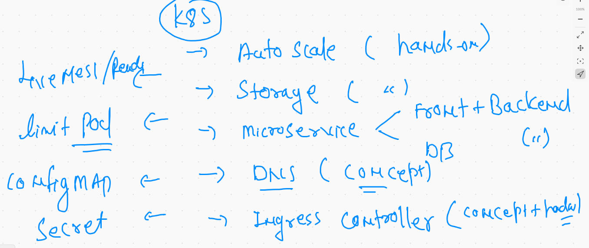
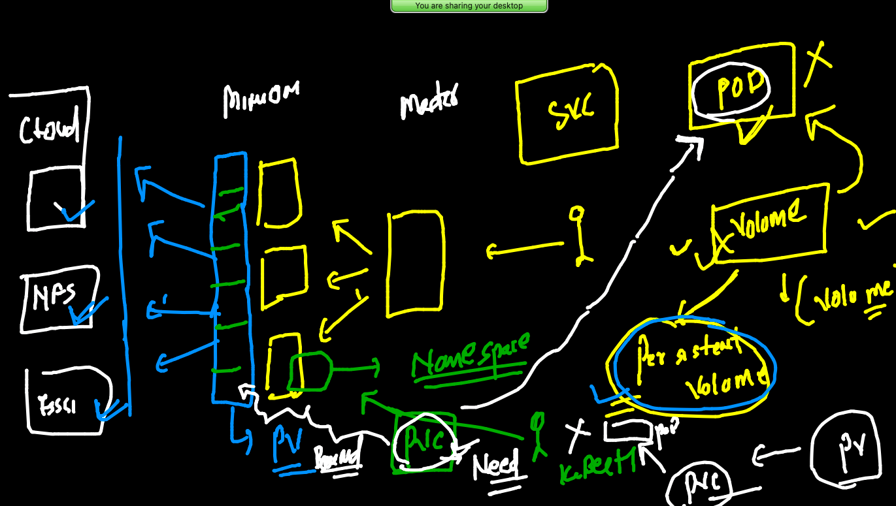

# Plan of traning and its execution 


## plan for the day 



## Storage in k8s


## k8s volume plugins 

[volume](https://kubernetes.io/docs/concepts/storage/volumes/)

## volume info 


## storage source location 


### EMptyDir volume type

```
❯ kubectl  run   emppod  --image=alpine  --namespace ashu-project   --dry-run=client -o yaml
apiVersion: v1
kind: Pod
metadata:
  creationTimestamp: null
  labels:
    run: emppod
  name: emppod
  namespace: ashu-project
spec:
  containers:
  - image: alpine
    name: emppod
    resources: {}
  dnsPolicy: ClusterFirst
  restartPolicy: Always
status: {}


```

### deploying pod 

```
❯ ls
alpine.yaml   ashusvc1.yaml empvol.yaml   mywebapp      pod2.yaml
ashupod1.yaml depsvc.yaml   mydeploy.yaml netpol1.yaml
❯ kubectl  apply -f  empvol.yaml --dry-run=client
pod/emppod created (dry run)
❯ kubectl  apply -f  empvol.yaml
pod/emppod created

```

### checking data 

```
❯ kubectl  get  po
NAME     READY   STATUS    RESTARTS   AGE
emppod   1/1     Running   0          7s
❯ kubectl  exec  -it  emppod  -- sh
/ # cd  /mnt/cisco/
/mnt/cisco # ls
time.txt
/mnt/cisco # cat  time.txt 
Fri Jul  2 05:00:16 UTC 2021
Fri Jul  2 05:00:21 UTC 2021
Fri Jul  2 05:00:26 UTC 2021
Fri Jul  2 05:00:31 UTC 2021
Fri Jul  2 05:00:36 UTC 2021
Fri Jul  2 05:00:41 UTC 2021
Fri Jul  2 05:00:46 UTC 2021
/mnt/cisco # cat  time.txt 
Fri Jul  2 05:00:16 UTC 2021
Fri Jul  2 05:00:21 UTC 2021
Fri Jul  2 05:00:26 UTC 2021
Fri Jul  2 05:00:31 UTC 2021
Fri Jul  2 05:00:36 UTC 2021
Fri Jul  2 05:00:41 UTC 2021
Fri Jul  2 05:00:46 UTC 2021
Fri Jul  2 05:00:51 UTC 2021
/mnt/cisco # exit

```

### POD with multiple containers


## demo of multi container pod 


## accessing containers 

```
❯ kubectl  exec  -it  emppod  -- bash
Defaulted container "ashungc1" out of: ashungc1, emppod
root@emppod:/# cd /usr/share/nginx/html/
root@emppod:/usr/share/nginx/html# ls
time.txt
root@emppod:/usr/share/nginx/html# exit
exit
❯ kubectl  exec  -it  emppod -c  emppod  -- sh
/ # cd /mnt/cisco/
/mnt/cisco # ls
time.txt
/mnt/cisco # exit

```

### creating service and hosting it

```
❯ kubectl  expose  pod  emppod  --type NodePort  --port 80  --dry-run=client -o yaml
apiVersion: v1
kind: Service
metadata:
  creationTimestamp: null
  labels:
    run: emppod
  name: emppod
spec:
  ports:
  - port: 80
    protocol: TCP
    targetPort: 80
  selector:
    run: emppod
  type: NodePort
status:
  loadBalancer: {}
❯ kubectl  expose  pod  emppod  --type NodePort  --port 80  --name ashusvc1
service/ashusvc1 exposed
❯ kubectl  get  svc
NAME       TYPE       CLUSTER-IP      EXTERNAL-IP   PORT(S)        AGE
ashusvc1   NodePort   10.98.224.162   <none>        80:31767/TCP   4s

```

## HostPath volume 


### checking mount point 

```
❯ kubectl  get po
NAME        READY   STATUS    RESTARTS   AGE
ashupox12   1/1     Running   0          7s
❯ kubectl exec  -it  ashupox12  -- sh
/ # cd  /myetc/
/myetc # ls
DIR_COLORS               exports                  mke2fs.conf              rsyslog.d
DIR_COLORS.256color      exports.d                modprobe.d               rwtab
DIR_COLORS.lightbgcolor  filesystems              modules-load.d           rwtab.d
GREP_COLORS              fstab                    motd                     sasl2
GeoIP.conf               gcryp

```

## PV and PVC concept in storage 



## Deploying a sample microservice example 

### creating PV 


```
❯ kubectl  get  pv
NAME          CAPACITY   ACCESS MODES   RECLAIM POLICY   STATUS      CLAIM   STORAGECLASS   REASON   AGE
ashupv-1      10Gi       RWX            Retain           Available           fast                    67s
dipanjanpv1   5Gi        RWX            Retain           Available           fast                    29s
sathyapv-1    5Gi        RWX            Retain           Available           fast                    64s
subhampv-1    10Gi       RWX            Retain           Available           fast                    63s
thirupv-1     10Gi       RWX            Retain           Available           fast                    8s
vritypv-1     5Gi        RWX            Retain           Available           fast                    49s

```

## claiming PVC 

```
# creating pvc 
apiVersion: v1
kind: PersistentVolumeClaim 
metadata:
 name: ashupvc-111
 namespace: ashu-project 
spec:
 resources:
  requests:
   storage: 5Gi
 accessModes:
 - ReadWriteMany
 storageClassName: fast
 
 
 ```
 
 ### 
 
 ```
 ❯ kubectl  get  pvc
NAME          STATUS   VOLUME       CAPACITY   ACCESS MODES   STORAGECLASS   AGE
ashupvc-111   Bound    sathyapv-1   5Gi        RWX            fast           79s


```

### understanding microservice plan 


### creating db YAML 

```
❯ kubectl  create  deployment  ashudb  --image=mysql:5.6 --namespace ashu-project  --dry-run=client -o yaml
apiVersion: apps/v1
kind: Deployment
metadata:
  creationTimestamp: null
  labels:
    app: ashudb
  name: ashudb
  namespace: ashu-project
spec:
  replicas: 1
  selector:
    matchLabels:
      app: ashudb
  strategy: {}
  template:
    metadata:
      creationTimestamp: null
      labels:
        app: ashudb
    spec:
      containers:
      - image: mysql:5.6
        name: mysql
        resources: {}
status: {}

```

### attaching pvc with DB pod / deploy 


### Introduction to secret 


### creating secret to store db password 

```
❯ kubectl  create  secret   generic  ashusec1  --from-literal  mypass=CiscoDb99
secret/ashusec1 created
❯ kubectl  get  secret
NAME                  TYPE                                  DATA   AGE
ashusec1              Opaque                                1      57s
default-token-xszbz   kubernetes.io/service-account-token   3      25h

```

### deploying DB 

```
❯ kubectl  get  pvc
NAME          STATUS   VOLUME       CAPACITY   ACCESS MODES   STORAGECLASS   AGE
ashupvc-111   Bound    sathyapv-1   5Gi        RWX            fast           38m
❯ kubectl  get  secret
NAME                  TYPE                                  DATA   AGE
ashusec1              Opaque                                1      6m57s
default-token-xszbz   kubernetes.io/service-account-token   3      25h
❯ kubectl  get  deploy
NAME     READY   UP-TO-DATE   AVAILABLE   AGE
ashudb   1/1     1            1           99s
❯ kubectl  get  po
NAME                      READY   STATUS    RESTARTS   AGE
ashudb-7f64f8ddf7-sddg7   1/1     Running   0          103s
❯ kubectl  logs  ashudb-7f64f8ddf7-sddg7
2021-07-02 07:37:54+00:00 [Note] [Entrypoint]: Entrypoint script for MySQL Server 5.6.51-1debian9 started.
2021-07-02 07:37:54+00:00 [Note] [Entrypoint]: Switching to dedicated user 'mysql'
2021-07-02 07:37:54+00:00 [Note] [Entrypoint]: Entrypoint script for MySQL Server 5.6.51-1debian9 started.
2021-07-02 07:37:54+00:00 [Note] [Entrypoint]: Initializing database files
2021-07-02 07:37:54 0 [Warning] TIMESTAMP with implicit DEFAULT value is deprecated. Please use --explicit_defaults_for_timestamp server option (see documentation for more details).
2021-07-02 07:37:54 0 [Note] Ignoring --secure-file-priv value as server is running with --bootstrap.
2021-07-02 07:37:54 0 [Note] /usr/sbin/mysqld (mysqld 5.6.51) starting as process 46 ...
2021-07-02 07:37:54 46 [Warning] Buffered warning: Changed limits: max_open_files: 1024 (requested 5000)

```

### creating service for DB pod -- cluster IP type 

```
❯ kubectl  expose  deploy  ashudb  --type ClusterIP   --port 3306  --dry-run=client -o yaml
apiVersion: v1
kind: Service
metadata:
  creationTimestamp: null
  labels:
    app: ashudb
  name: ashudb
spec:
  ports:
  - port: 3306
    protocol: TCP
    targetPort: 3306
  selector:
    app: ashudb
  type: ClusterIP
status:
  loadBalancer: {}

```

### creating service 

```
❯ kubectl apply -f  myapp.yml
persistentvolumeclaim/ashupvc-111 unchanged
deployment.apps/ashudb configured
service/ashudb created

===

❯ kubectl  get  svc
NAME     TYPE        CLUSTER-IP     EXTERNAL-IP   PORT(S)    AGE
ashudb   ClusterIP   10.101.9.159   <none>        3306/TCP   26s

```

### creating web app deployment 

```
❯ kubectl   create  deployment  ashuweb  --image=wordpress:4.8-apache --namespace ashu-project   --dry-run=client -o yaml
apiVersion: apps/v1
kind: Deployment
metadata:
  creationTimestamp: null
  labels:
    app: ashuweb
  name: ashuweb
  namespace: ashu-project
spec:
  replicas: 1
  selector:
    matchLabels:
      app: ashuweb
  strategy: {}
  template:
    metadata:
      creationTimestamp: null
      labels:
        app: ashuweb
    spec:
      containers:
      - image: wordpress:4.8-apache
        name: wordpress
        resources: {}
status: {}


```


### creating service nodeport for webapp

```
❯ kubectl  expose deployment  ashuweb  --type NodePort --port 80  --dry-run=client  -o yaml
apiVersion: v1
kind: Service
metadata:
  creationTimestamp: null
  labels:
    app: ashuweb
  name: ashuweb
spec:
  ports:
  - port: 80
    protocol: TCP
    targetPort: 80
  selector:
    app: ashuweb
  type: NodePort
status:
  loadBalancer: {}

```


